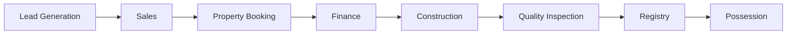
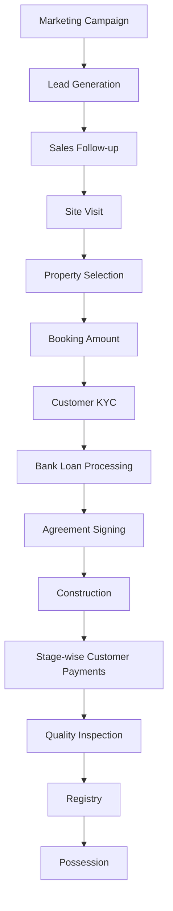
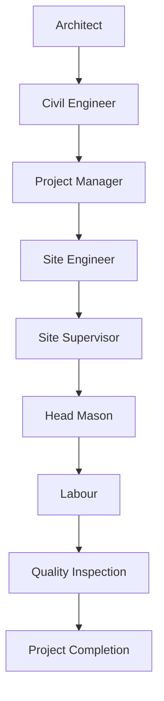
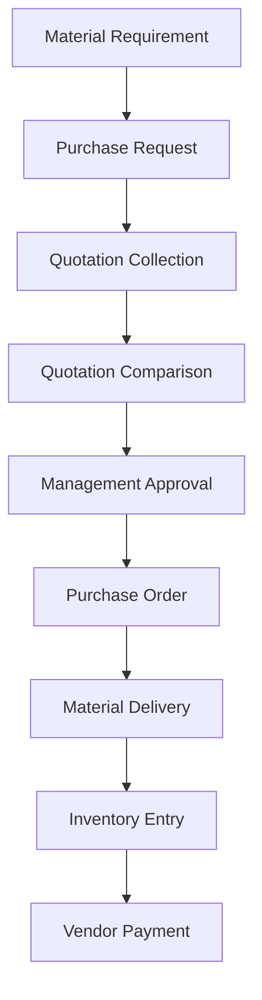
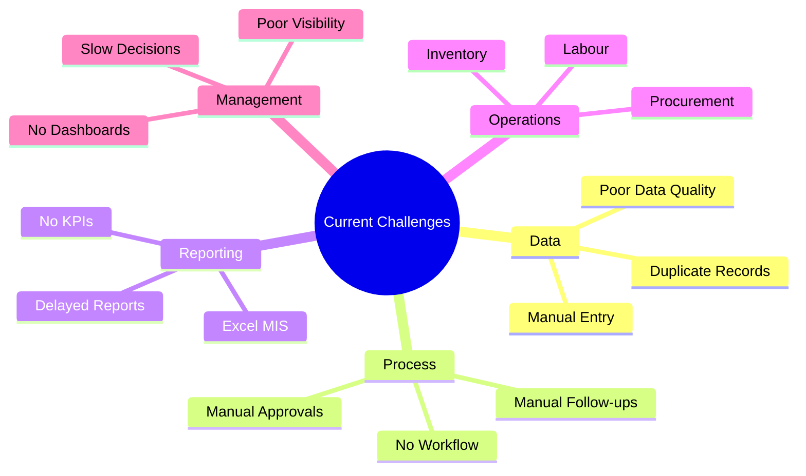
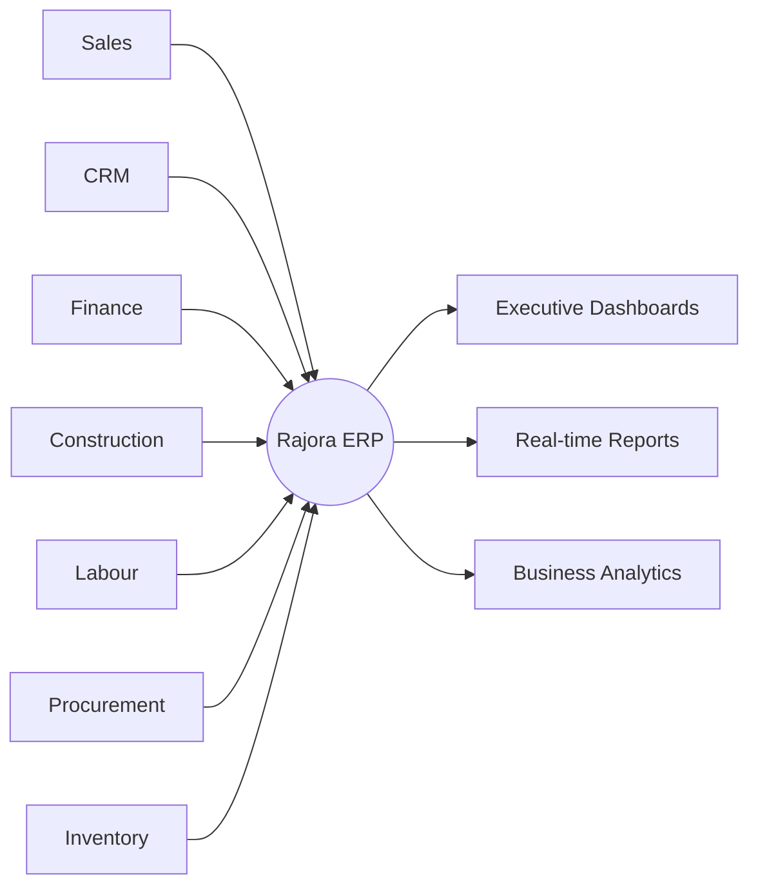
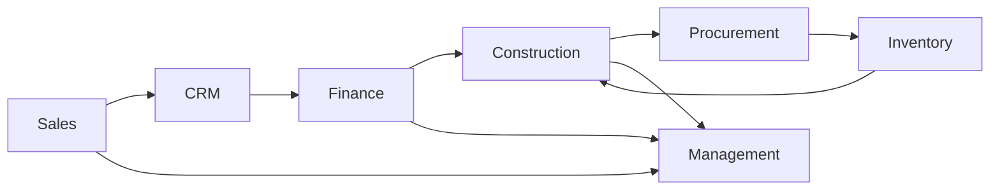
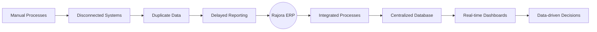
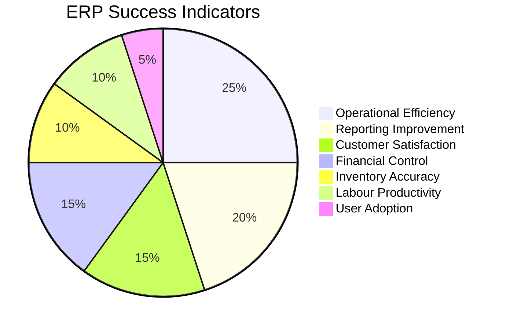
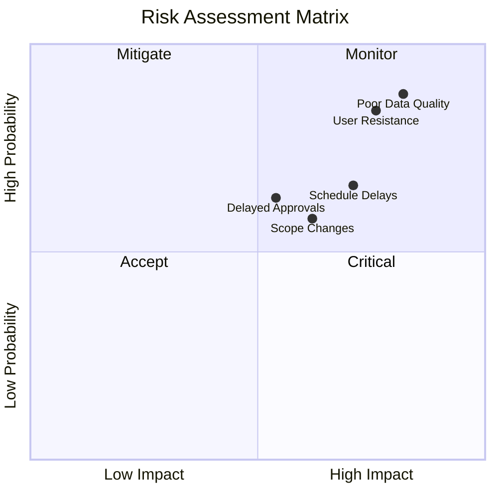

# Business Discovery Notes

> **Project:** Rajora ERP – Enterprise Residential Construction Management System  
> **Company:** Rajora Infra Homes  
> **Document ID:** BDN-001  
> **Version:** 1.0  
> **Prepared By:** Shikha Phogat – Business Analyst  
> **Prepared For:** Rajora Infra Homes Management  
> **Date:** July 2026  
> **Document Status:** Approved for Requirement Elicitation Phase

---

## Document Overview

The **Business Discovery Notes** document captures the findings from the Discovery Phase of the Rajora ERP implementation project. It provides a comprehensive understanding of the organization's current business operations, stakeholders, processes, operational challenges, and strategic objectives before detailed requirement gathering begins.

This document serves as the foundation for all subsequent Business Analysis deliverables, including the Business Requirements Document (BRD), Functional Requirements Document (FRD), User Stories, Process Models, and Testing documentation.

---

## Table of Contents

- [1. Purpose](#1-purpose)
- [2. Company Overview](#2-company-overview)
- [3. Business Overview](#3-business-overview)
- [4. Current Business Process](#4-current-business-process)
- [5. Existing Software & Tools](#5-existing-software--tools)
- [6. Current Challenges](#6-current-challenges)
- [7. ERP Objectives](#7-erp-objectives)
- [8. Departments](#8-departments)
- [9. Stakeholder Analysis](#9-stakeholder-analysis)
- [10. Business Modules](#10-business-modules)
- [11. AS-IS vs TO-BE Analysis](#11-as-is-vs-to-be-analysis)
- [12. Success Metrics](#12-success-metrics)
- [13. Assumptions](#13-assumptions)
- [14. Constraints](#14-constraints)
- [15. Risks](#15-risks)
- [16. Conclusion](#16-conclusion)
- [Document Approval](#document-approval)

---

# 1. Purpose

The purpose of this **Business Discovery Document** is to understand the existing business operations of **Rajora Infra Homes** and establish a comprehensive understanding of its organizational structure, operational processes, stakeholders, business challenges, and strategic objectives.

The Discovery Phase is the first stage of the ERP implementation lifecycle. During this phase, the Business Analyst works with stakeholders to understand how the organization currently operates, identify pain points, and define the overall business vision for the proposed ERP solution.

The information documented here provides the business context required before requirement gathering and business analysis activities begin.

### Key Objectives

- Understand current business operations.
- Identify operational challenges and process inefficiencies.
- Understand organizational structure and stakeholder responsibilities.
- Capture the current ("AS-IS") business processes.
- Define the future ("TO-BE") business vision.
- Establish the baseline for ERP implementation.

---

## Deliverables Supported

The Business Discovery phase provides the foundation for the following project deliverables:

| Deliverable | Purpose |
|-------------|---------|
| Business Requirements Document (BRD) | Capture business needs and objectives |
| Functional Requirements Document (FRD) | Define detailed system functionality |
| User Stories | Support Agile development |
| Process Models | Document business workflows |
| Wireframes | Design application screens |
| Solution Design | Define technical architecture |
| Test Cases | Validate business requirements |

---

# 2. Company Overview

## Organization Profile

| Attribute | Details |
|-----------|---------|
| **Company Name** | Rajora Infra Homes |
| **Industry** | Real Estate Development & Residential Construction |
| **Project** | Rajora Estate |
| **Project Type** | Residential Township |
| **Total Units** | Approximately 125 Duplex Homes |

---

## Business Description

Rajora Infra Homes is a regional real estate development company engaged in the planning, construction, marketing, and sale of residential housing projects.

The organization manages the complete customer lifecycle—from lead generation and property booking through construction, financing, registration, and final possession.

In addition to customer-facing operations, the company also manages procurement, labour operations, inventory, finance, customer relationship management, and executive reporting.

---

## Residential Property Portfolio

| Property Type | Plot Size | Built-up Area | Approximate Price |
|--------------|-----------|---------------|------------------:|
| Type A | 21 × 45 ft | 945 sq ft | ₹80 Lakhs |
| Type B | 18 × 45 ft | 810 sq ft | ₹65 Lakhs |
| Type C | 18 × 36 ft | 648 sq ft | ₹55 Lakhs |
| Type D | 15 × 36 ft | 540 sq ft | ₹45 Lakhs |

---

## Target Customer Segments

Rajora Infra Homes primarily serves the following customer groups:

- First-time home buyers
- Families
- Government employees
- Working professionals
- Property investors
- Customers purchasing through bank finance

---

## Business Value Chain

---

> **Business Insight**
>
> Rajora Infra Homes currently manages multiple business functions using disconnected systems. The proposed ERP implementation aims to integrate these functions into a centralized platform, providing improved operational efficiency, data accuracy, and real-time decision-making capabilities.

---

# 3. Business Overview

Rajora Infra Homes currently manages multiple business functions that work together throughout the lifecycle of a residential construction project. While each department performs its own activities, information is primarily maintained in separate spreadsheets and manual registers, leading to duplicate data, delayed communication, and limited cross-functional visibility.

The organization performs the following core business functions:

| Business Function | Description |
|-------------------|-------------|
| Sales & Marketing | Generate leads, conduct marketing campaigns, and convert prospects into customers. |
| Customer Relationship Management (CRM) | Maintain customer interactions, follow-ups, and enquiry management. |
| Property Booking | Manage unit selection, booking confirmation, and agreement execution. |
| Loan Coordination | Coordinate with banks for customer home loan processing and approvals. |
| Construction Planning | Plan construction schedules, milestones, and resource allocation. |
| Project Execution | Monitor on-site construction activities and project progress. |
| Labour Management | Manage labour deployment, attendance, productivity, and wage tracking. |
| Vendor Management | Maintain vendor information and evaluate supplier performance. |
| Procurement | Handle material requisitions, purchase approvals, purchase orders, and deliveries. |
| Inventory Management | Track material receipts, issues, stock levels, and consumption. |
| Finance & Accounts | Manage customer collections, invoices, receipts, expenses, and financial reporting. |
| Executive Reporting | Prepare management reports and monitor organizational KPIs. |

> **Observation**
>
> Each department currently maintains independent records. This creates duplicate information, manual coordination efforts, reporting delays, and inconsistent business data.

---

# 4. Current Business Process

The existing customer journey consists of multiple business departments working together from lead generation to property possession.

## Customer Lifecycle

---

## Construction Workflow

---

## Procurement Workflow

---

## Current Business Process Summary

| Process | Current Approach |
|----------|------------------|
| Lead Management | Manual Excel registers |
| Customer Follow-ups | Phone calls, WhatsApp, and Excel |
| Property Booking | Manual forms and spreadsheets |
| Construction Updates | Daily site registers |
| Labour Attendance | Paper attendance register |
| Procurement | Manual approvals |
| Inventory Tracking | Excel-based stock registers |
| Financial Reporting | Excel MIS reports |

---

# 5. Existing Software & Tools

Business operations are currently managed using multiple disconnected systems, resulting in fragmented information and manual coordination across departments.

## Software Applications

| Software | Purpose |
|-----------|---------|
| Microsoft Excel | Data management and reporting |
| Microsoft Word | Documentation |
| Email | Official communication |
| WhatsApp | Internal communication and approvals |

---

## Excel Registers

The following Excel files are maintained independently by different departments:

| Register | Department |
|-----------|------------|
| Customer Register | Sales |
| Sales Register | Sales |
| Booking Register | Sales |
| Payment Ledger | Finance |
| Loan Tracker | Finance |
| Labour Attendance | HR & Labour |
| Wage Register | HR & Labour |
| Material Register | Inventory |
| Purchase Register | Procurement |
| Vendor Register | Procurement |
| Expense Register | Finance |
| MIS Reports | Management |

---

## Manual Registers

Several operational activities are still maintained using physical registers.

| Register | Purpose |
|-----------|---------|
| Visitor Register | Record visitor entries |
| Material Issue Register | Track material movement |
| Site Diary | Daily construction updates |
| Inspection Register | Record quality inspections |
| Labour Attendance Register | Daily labour attendance |
| Purchase Approval Register | Manual purchase approvals |

---

## Current Reporting Process

Management reports are currently prepared using:

- Microsoft Excel
- Pivot Tables
- Charts
- Email
- WhatsApp

The reporting process is highly manual and requires data collection from multiple departments before reports can be consolidated.

> **Key Observation**
>
> The organization lacks a centralized ERP platform. Most business data is stored in isolated Excel files, requiring manual consolidation for operational and executive reporting. This increases reporting time, introduces data inconsistencies, and limits real-time visibility into business performance.

---

# 6. Current Challenges

During the Business Discovery phase, several operational and process-related challenges were identified across the organization. Most of these challenges originate from the use of disconnected systems, manual processes, and the absence of a centralized information repository.

## Data Management Challenges

| Challenge | Business Impact |
|------------|-----------------|
| Duplicate customer records | Inconsistent customer information and reporting |
| Duplicate vendor records | Difficulty maintaining supplier history |
| Inconsistent naming conventions | Reduced data quality and reporting accuracy |
| Multiple Excel versions | Version control issues |
| Missing information | Incomplete business records |
| Manual data entry | Increased probability of human errors |

---

## Process Challenges

| Challenge | Business Impact |
|------------|-----------------|
| Manual approval process | Delayed business decisions |
| Delayed communication | Slow coordination between departments |
| No workflow automation | Increased manual effort |
| Manual follow-ups | Missed customer opportunities |
| Poor document management | Difficulty retrieving historical information |

---

## Reporting Challenges

| Challenge | Business Impact |
|------------|-----------------|
| Manual MIS preparation | Increased reporting effort |
| Delayed reports | Management decisions are delayed |
| Difficult historical analysis | Limited business insights |
| Limited KPI visibility | Performance monitoring becomes difficult |
| Manual report consolidation | Time-consuming reporting process |

---

## Operational Challenges

| Challenge | Business Impact |
|------------|-----------------|
| No centralized customer database | Duplicate customer information |
| No integrated inventory management | Stock visibility issues |
| Manual labour management | Attendance and wage inaccuracies |
| Procurement delays | Material shortages at project sites |
| Limited project monitoring | Reduced control over project execution |

---

## Management Challenges

| Challenge | Business Impact |
|------------|-----------------|
| Lack of executive dashboards | Limited real-time visibility |
| Delayed decision-making | Reduced operational efficiency |
| Department-wise data silos | Difficult cross-functional reporting |
| Limited project visibility | Delayed corrective actions |
| Limited forecasting capability | Reactive rather than proactive decisions |

---

## Challenge Summary

> **Business Insight**
>
> Most operational challenges are not caused by the business processes themselves but by the absence of an integrated ERP platform. A centralized system can significantly reduce manual effort while improving data accuracy and decision-making.

---

# 7. ERP Objectives

The proposed ERP solution aims to digitize and integrate all major business functions within Rajora Infra Homes, enabling standardized processes, centralized data management, and real-time reporting.

---

## Business Objectives

| Objective | Expected Outcome |
|------------|------------------|
| Digitize business operations | Eliminate manual paperwork |
| Reduce Excel dependency | Centralized ERP platform |
| Improve operational efficiency | Faster business processes |
| Improve collaboration | Better communication across departments |
| Standardize business processes | Consistent operations |
| Increase reporting accuracy | Reliable management information |
| Improve customer service | Better customer experience |
| Enable data-driven decisions | Real-time business insights |

---

## Operational Objectives

| Objective | Expected Outcome |
|------------|------------------|
| Centralized customer database | Single source of truth |
| Integrated inventory management | Accurate stock tracking |
| Automated procurement workflow | Faster purchasing cycle |
| Digital labour management | Improved workforce tracking |
| Online approval workflows | Reduced approval delays |
| Automated reporting | Faster MIS generation |

---

## Executive Objectives

| Objective | Expected Outcome |
|------------|------------------|
| Executive dashboards | Organization-wide visibility |
| KPI monitoring | Performance tracking |
| Project health monitoring | Improved project control |
| Collection monitoring | Better cash flow management |
| Cost monitoring | Improved financial control |
| Performance analytics | Data-driven strategic planning |

---

## ERP Vision

---

# 8. Departments

The following departments participate in the end-to-end business operations of Rajora Infra Homes.

| Department | Primary Responsibilities |
|------------|--------------------------|
| Sales | Lead generation, customer acquisition, property booking |
| CRM | Customer communication and follow-ups |
| Finance | Collections, accounting, invoices, banking |
| Construction | Project execution and monitoring |
| Engineering | Technical supervision and inspections |
| Procurement | Material purchasing and vendor coordination |
| Inventory | Material receipt, issue, and stock management |
| HR & Labour | Attendance, wages, labour deployment |
| Executive Management | Strategic planning and KPI monitoring |

---

## Department Interaction

---

# 9. Stakeholder Analysis

The following stakeholders were identified during the Discovery Phase.

| Stakeholder | Role | Responsibilities | Pain Points | ERP Expectations |
|-------------|------|------------------|-------------|------------------|
| Managing Director | Project Sponsor | Business decisions | Limited business visibility | Executive Dashboard |
| CEO | Executive Sponsor | Strategic planning | Delayed reporting | Real-time KPIs |
| Sales Manager | Business User | Sales operations | Manual follow-ups | CRM Automation |
| CRM Executive | Business User | Customer communication | Disconnected customer history | Customer 360° View |
| Finance Manager | Business User | Collections & Accounting | Manual reconciliation | Integrated Finance Module |
| Project Manager | Business User | Construction execution | Limited project visibility | Construction Dashboard |
| Site Engineer | Business User | Daily progress updates | Manual reporting | Mobile progress updates |
| Labour Supervisor | Business User | Labour deployment | Attendance registers | Digital attendance |
| Procurement Manager | Business User | Purchasing | Manual approvals | Automated workflow |
| Store Manager | Business User | Inventory | Stock inaccuracies | Real-time inventory |
| Customers | External Stakeholder | Property purchase | Limited payment visibility | Better service |
| Vendors | External Stakeholder | Material supply | Delayed communication | Vendor management |

---

# 10. Business Modules

The proposed ERP solution will consist of the following integrated business modules.

| Module | Purpose | Primary Users | Key Data |
|---------|---------|---------------|----------|
| Sales CRM | Lead and enquiry management | Sales Team | Leads, Follow-ups |
| Customer Management | Customer lifecycle management | Sales & CRM | Customer Master |
| Booking | Property reservation | Sales | Booking Details |
| Loan Management | Bank coordination | Finance | Loan Records |
| Construction | Project monitoring | Engineers | Progress Updates |
| Labour Management | Attendance & wages | HR | Labour Records |
| Inventory | Material management | Store | Stock Records |
| Procurement | Material purchasing | Purchase Team | Purchase Orders |
| Vendor Management | Vendor lifecycle | Procurement | Vendor Master |
| Finance | Collections & accounting | Accounts | Payments & Invoices |
| Reporting & Analytics | KPI monitoring | Management | Executive Reports |

> **Module Integration**
>
> Each ERP module shares a centralized database, ensuring a **single source of truth** across the organization. This eliminates duplicate records, improves data consistency, and enables real-time reporting and analytics.

---

# 11. AS-IS vs TO-BE Analysis

The Business Discovery phase identified several opportunities to improve operational efficiency by replacing manual processes with an integrated ERP solution.

## Current State vs Future State

| Business Area | AS-IS (Current State) | TO-BE (Future State) |
|---------------|-----------------------|----------------------|
| Customer Data | Multiple Excel files | Centralized Customer Master |
| Lead Management | Manual tracking | Automated CRM workflow |
| Property Booking | Spreadsheet-based booking | Real-time booking management |
| Construction Monitoring | Manual site updates | Live project progress tracking |
| Labour Attendance | Paper registers | Digital attendance management |
| Procurement | Manual approvals | Workflow-based approvals |
| Inventory | Separate stock registers | Centralized inventory system |
| Reporting | Manual MIS preparation | Automated dashboards |
| Decision Making | Historical reports | Real-time analytics |
| Communication | Phone, Email & WhatsApp | Integrated ERP notifications |

---

## Business Transformation

---

## Expected Business Benefits

### Operational Benefits

- Standardized business processes
- Reduced manual effort
- Faster approval cycles
- Improved inter-department collaboration
- Centralized data repository

### Financial Benefits

- Improved collection tracking
- Better budget monitoring
- Reduced operational costs
- Improved financial reporting accuracy

### Customer Benefits

- Faster response to enquiries
- Improved customer communication
- Better payment visibility
- Enhanced customer experience

### Management Benefits

- Real-time dashboards
- KPI monitoring
- Faster decision-making
- Better project visibility
- Improved forecasting capabilities

---

# 12. Success Metrics

The success of the ERP implementation will be measured using the following Key Performance Indicators (KPIs).

| KPI | Current State | Target |
|-----|---------------|--------|
| Manual Reporting Effort | High | Reduce by 80% |
| Duplicate Customer Records | Frequent | Reduce by 90% |
| Report Preparation Time | Several Hours | Under 15 Minutes |
| Purchase Approval Cycle | Manual | Reduce by 50% |
| Customer Payment Visibility | Partial | 100% Visibility |
| Inventory Accuracy | Moderate | Above 98% |
| Executive Dashboard Availability | Not Available | Real-time |
| User Adoption Rate | N/A | Above 90% |

---

## Success Measurement Dashboard

---

# 13. Assumptions

The following assumptions have been made during the Business Discovery phase.

- All departments will actively participate in ERP implementation.
- Existing business data will be available for migration.
- Business users will participate in requirement validation workshops.
- Users will receive adequate ERP training before Go-Live.
- Internet connectivity will be available across all project locations.
- Management will support organizational change throughout implementation.
- Existing business processes accurately represent current operations.

---

# 14. Constraints

The project is subject to the following constraints.

| Constraint | Description |
|------------|-------------|
| Budget | Fixed implementation budget |
| Timeline | Fixed implementation schedule |
| Scope | Initial rollout limited to Rajora Estate |
| Data Quality | Existing data requires cleansing before migration |
| User Availability | Limited availability during peak operations |
| Technical Skills | Some users have limited ERP experience |

---

# 15. Risks

The following risks were identified during the Discovery phase.

| Risk | Impact | Mitigation Strategy |
|------|--------|---------------------|
| Poor data quality | High | Data cleansing before migration |
| Resistance to change | High | User training and change management |
| Requirement changes | Medium | Formal change control process |
| Delayed stakeholder approvals | Medium | Weekly governance meetings |
| Project schedule delays | Medium | Regular project monitoring |
| User adoption issues | Medium | Early user involvement and training |

---

## Risk Overview

---

# 16. Conclusion

The Business Discovery phase provided a comprehensive understanding of Rajora Infra Homes' current business operations, organizational structure, operational workflows, and strategic objectives.

The analysis highlighted several opportunities for improvement, including:

- Eliminating duplicate and fragmented data.
- Automating manual business processes.
- Improving collaboration between departments.
- Enhancing reporting accuracy and availability.
- Providing management with real-time visibility into business performance.

The proposed **Rajora ERP** solution will integrate Sales, CRM, Construction, Finance, Procurement, Inventory, Labour Management, and Executive Reporting into a single centralized platform.

This document establishes the baseline for the next phase of the project—**Requirement Elicitation**—where detailed business requirements will be gathered, analyzed, validated, and documented to support solution design and implementation.

---

# Document Approval

| Role | Name | Status |
|------|------|--------|
| Business Analyst | Shikha Phogat | Approved |
| Project Sponsor | Managing Director Vishutosh Singh | Pending |

---

## Related Documents

| Document | Description |
|----------|-------------|
| Requirement Elicitation Document | Captures detailed stakeholder requirements |
| Business Requirements Document (BRD) | Defines business requirements and scope |
| Functional Requirements Document (FRD) | Describes system functionality |
| Stakeholder Register | Identifies stakeholders and responsibilities |
| AS-IS Process Analysis | Documents current business processes |
| TO-BE Process Analysis | Defines future business processes |

---

> **Document Status:** Approved for Requirement Elicitation Phase

**Version:** 1.0  
**Prepared By:** Shikha Phogat – Business Analyst  
**Project:** Rajora ERP – Enterprise Residential Construction Management System

---

