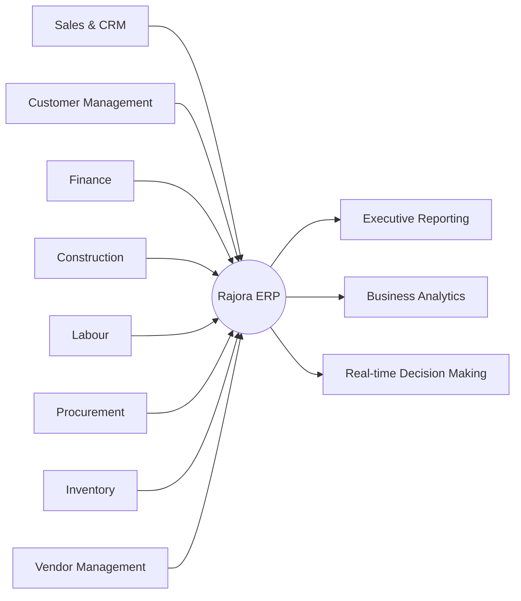
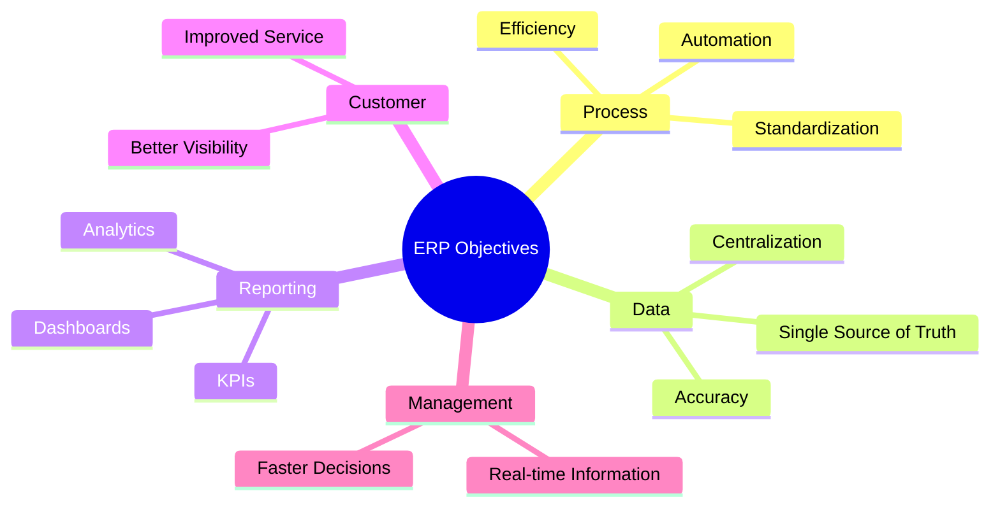
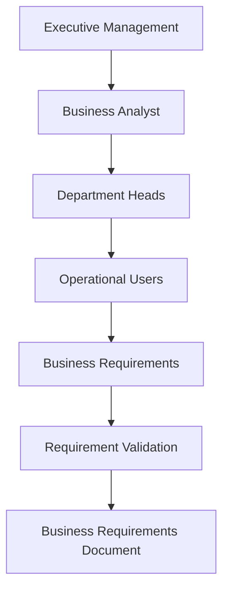
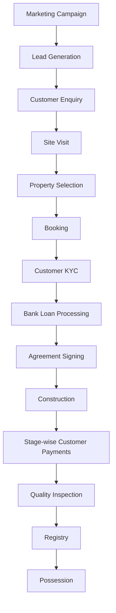
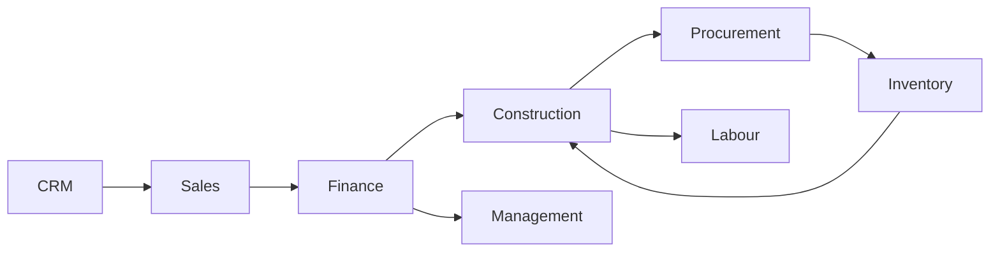
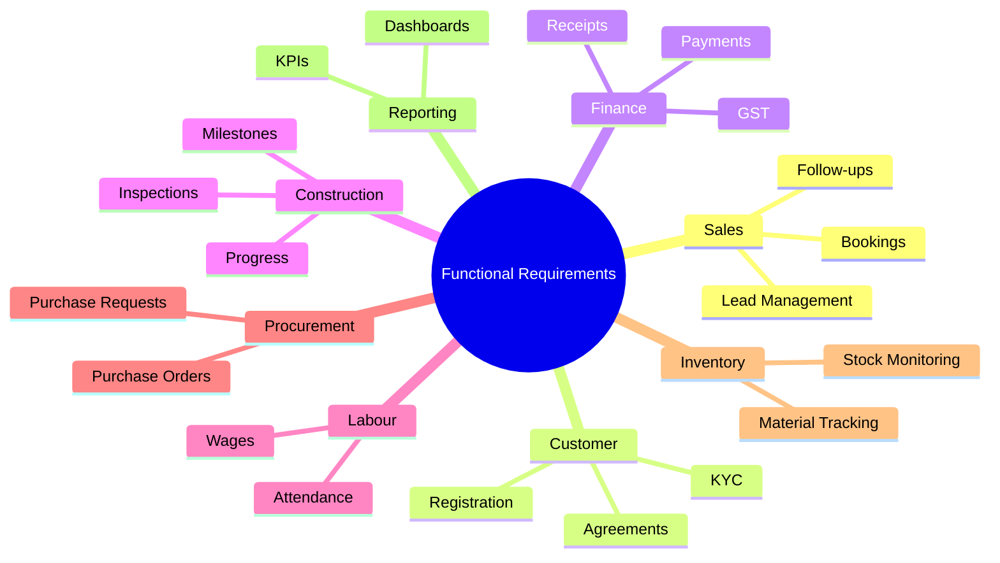
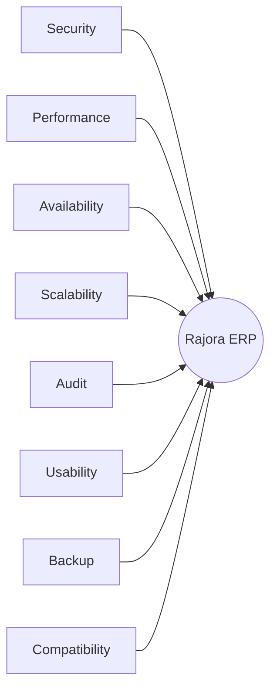
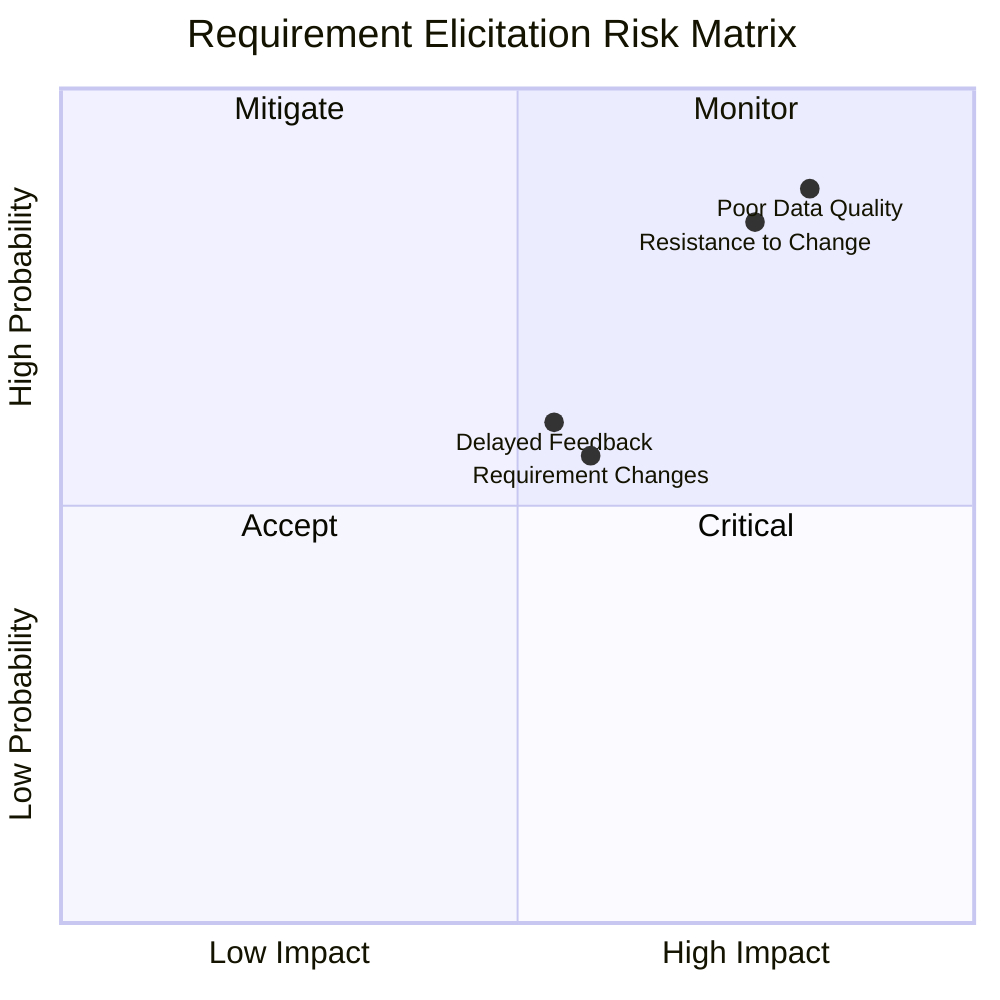
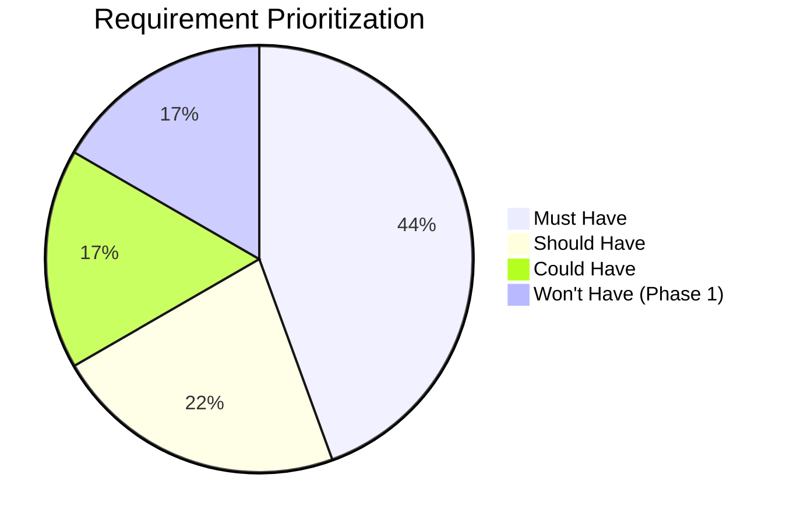
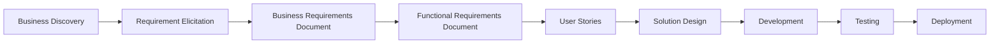

# Requirement Elicitation Document (RED)

> **Project:** Rajora ERP – Enterprise Residential Construction Management System  
> **Company:** Rajora Infra Homes  
> **Document ID:** RED-001  
> **Version:** 1.0  
> **Prepared By:** Shikha Phogat – Business Analyst  
> **Prepared For:** Rajora Infra Homes Management  
> **Date:** July 2026  
> **Document Status:** Approved for Business Requirements Documentation (BRD)

---

# Document Overview

The **Requirement Elicitation Document (RED)** captures, validates, and documents the business needs identified during interactions with stakeholders across Rajora Infra Homes.

The information documented in this report serves as the primary input for preparing the:

- Business Requirements Document (BRD)
- Functional Requirements Document (FRD)
- User Stories
- Process Models
- Solution Design
- Test Cases
- User Acceptance Testing (UAT)

This document represents the transition between the **Business Discovery Phase** and the **Business Analysis Phase**, ensuring that stakeholder expectations are clearly understood before detailed solution design begins.

---

# Table of Contents

- [1. Purpose](#1-purpose)
- [2. Project Vision](#2-project-vision)
- [3. Business Objectives](#3-business-objectives)
- [4. Requirement Gathering Approach](#4-requirement-gathering-approach)
- [5. Stakeholders](#5-stakeholders)
- [6. Existing Business Process](#6-existing-business-process)
- [7. Stakeholder Interviews](#7-stakeholder-interviews)
- [8. Functional Requirements](#8-functional-requirements-high-level)
- [9. Non-Functional Requirements](#9-non-functional-requirements)
- [10. Business Rules](#10-business-rules)
- [11. Assumptions](#11-assumptions)
- [12. Constraints](#12-constraints)
- [13. Risks](#13-risks)
- [14. Requirement Prioritization (MoSCoW)](#14-requirement-prioritization-moscow)
- [15. Open Items](#15-open-items)
- [16. Conclusion](#16-conclusion)
- [Document Approval](#document-approval)

---

# 1. Purpose

The purpose of this document is to capture, validate, and document the business requirements for implementing the **Rajora ERP** solution at **Rajora Infra Homes**.

Requirements documented in this report have been gathered through stakeholder interviews, process observation, analysis of existing operational documents, and collaborative requirement discussions across multiple business departments.

The documented requirements will serve as the foundation for all subsequent phases of the Software Development Life Cycle (SDLC), including business analysis, solution design, development, testing, and deployment.

---

## Deliverables Supported

| Deliverable | Purpose |
|-------------|---------|
| Business Requirements Document (BRD) | Defines approved business requirements |
| Functional Requirements Document (FRD) | Specifies system functionality |
| User Stories | Supports Agile development |
| Process Models | Documents business workflows |
| Solution Design | Guides technical implementation |
| Test Cases | Enables requirement validation |
| User Acceptance Testing (UAT) | Confirms business expectations |

> **Business Analyst Note**
>
> Requirement elicitation is one of the most critical phases of an ERP implementation because it ensures that the proposed solution reflects actual business needs rather than assumptions.

---

# 2. Project Vision

Rajora Infra Homes currently manages business operations through multiple Excel spreadsheets, manual registers, and isolated reporting practices. While these processes support day-to-day operations, they create duplicate records, reporting delays, inconsistent information, and limited visibility across departments.

The proposed **Rajora ERP** aims to consolidate these disconnected processes into a centralized platform that supports standardized operations, integrated data management, and real-time decision-making.

---

## ERP Vision

---

## Business Domains Covered

| Business Domain | Purpose |
|-----------------|---------|
| Sales & CRM | Lead generation, follow-ups, and customer acquisition |
| Customer Management | Customer lifecycle management |
| Booking Management | Property booking and reservation |
| Loan Management | Home loan coordination |
| Construction Management | Project execution and progress monitoring |
| Labour Management | Workforce attendance and wage administration |
| Procurement | Material purchasing and approvals |
| Vendor Management | Vendor registration and evaluation |
| Inventory Management | Material receipt, issue, and stock control |
| Finance & Accounts | Collections, receipts, accounting, and reporting |
| Executive Reporting & Analytics | KPI dashboards and management reporting |

> **Vision Statement**
>
> Deliver an integrated ERP platform that centralizes business operations, improves collaboration, automates manual processes, and provides management with reliable, real-time business information.

---

# 3. Business Objectives

During stakeholder discussions, several strategic objectives were identified to guide the ERP implementation.

## Strategic Objectives

| Objective | Expected Business Outcome |
|------------|---------------------------|
| Replace manual Excel-based operations | Centralized business management |
| Improve collaboration between departments | Better operational coordination |
| Eliminate duplicate records | Improved data quality |
| Enable real-time tracking | Better operational visibility |
| Improve management reporting | Faster decision-making |
| Automate approval workflows | Reduced manual effort |
| Increase operational efficiency | Streamlined business processes |
| Improve data accuracy | Reliable information for reporting |
| Enhance customer experience | Better visibility into bookings and payments |

---

## Expected Business Benefits

---

# 4. Requirement Gathering Approach

Business requirements were identified using multiple elicitation techniques to ensure comprehensive stakeholder participation and accurate documentation.

Rather than relying on a single information source, the Business Analysis team combined interviews, observation, document reviews, collaborative workshops, and brainstorming sessions to understand both current operations and future business expectations.

---

## Requirement Elicitation Techniques

| Technique | Purpose |
|-----------|---------|
| Stakeholder Interviews | Understand business goals, expectations, and operational challenges |
| Process Observation | Analyze existing day-to-day workflows |
| Document Analysis | Review Excel files, reports, forms, and business registers |
| Workshops | Validate cross-functional business requirements |
| Brainstorming Sessions | Identify opportunities for automation and process improvement |

---

## Requirement Gathering Process

---

## Deliverables from the Elicitation Phase

| Output | Description |
|--------|-------------|
| Validated Business Requirements | Approved stakeholder requirements |
| Current Process Understanding | Documentation of existing workflows |
| Requirement Register | Consolidated list of identified requirements |
| Stakeholder Expectations | Business goals and success criteria |
| Input for BRD | Foundation for detailed business requirements |

> **Key Observation**
>
> Using multiple elicitation techniques ensured that requirements were validated from different business perspectives, reducing ambiguity and improving the overall quality of the documented requirements.

---
---

# 5. Stakeholders

Successful ERP implementation requires active participation from stakeholders across all business functions. During the Requirement Elicitation phase, representatives from each department were consulted to understand their operational challenges, expectations, and functional requirements.

## Stakeholder Register

| Stakeholder | Department | Primary Responsibility |
|-------------|------------|------------------------|
| Managing Director | Executive Management | Strategic planning and business decisions |
| CEO | Executive Management | ERP vision and organizational objectives |
| Sales Manager | Sales | Lead generation and customer acquisition |
| CRM Executive | Customer Relationship Management | Customer communication and follow-ups |
| Finance Manager | Finance | Collections, accounting, and financial reporting |
| Project Manager | Construction | Project planning and execution |
| Site Engineer | Construction | Daily site supervision |
| Labour Supervisor | Operations | Labour attendance and workforce deployment |
| Procurement Manager | Procurement | Purchasing and vendor coordination |
| Store Manager | Inventory | Material receipt, issue, and stock control |
| Customers | External Stakeholder | Property purchase and payment |
| Vendors | External Stakeholder | Material supply and services |

---

## Stakeholder Classification

| Stakeholder Group | Role During ERP Project |
|-------------------|------------------------|
| Executive Management | Project sponsorship and strategic decisions |
| Department Heads | Requirement validation and business approvals |
| Operational Users | Day-to-day process experts |
| External Stakeholders | Customer and vendor expectations |
| Business Analyst | Requirement gathering, analysis, and documentation |

---

## Stakeholder Engagement Model

> **Business Insight**
>
> Early stakeholder engagement reduces requirement ambiguity, improves solution acceptance, and minimizes costly changes during later project phases.

---

# 6. Existing Business Process

The existing business workflow follows the complete customer lifecycle, beginning with lead generation and ending with property possession. Supporting activities such as procurement, labour management, inventory control, and financial reporting operate independently using spreadsheets and manual registers.

---

## Current Customer Journey

---

## Supporting Operational Functions

---

## Current Process Observations

| Observation | Business Impact |
|-------------|-----------------|
| Customer information maintained across multiple Excel files | Duplicate records |
| Manual follow-up activities | Missed opportunities |
| Labour attendance maintained in paper registers | Wage calculation delays |
| Procurement approvals are paper-based | Slow purchasing cycle |
| Inventory updates are manual | Stock visibility issues |
| Reports require manual consolidation | Delayed management decisions |

> **Key Finding**
>
> Although departmental processes are well established, the absence of an integrated ERP platform creates data silos and significant manual effort across the organization.

---

# 7. Stakeholder Interviews

Stakeholder interviews were conducted to understand departmental workflows, operational pain points, reporting needs, and expectations from the proposed ERP solution.

Each interview followed a structured approach consisting of:

- Interview Objective
- Discussion Topics
- Key Findings
- Business Requirements Identified

---

# 7.1 Executive Management

## Objective

Understand the organization's strategic goals, operational challenges, reporting expectations, and long-term vision for the ERP implementation.

---

### Discussion Topics

- Current operational challenges
- Departments requiring automation
- Executive reporting requirements
- Real-time information needs
- Expected business improvements

---

### Key Findings

| Observation | Business Impact |
|-------------|-----------------|
| Departments maintain separate Excel files | Information duplication |
| Reports require manual consolidation | Slow executive reporting |
| Limited real-time project visibility | Delayed decision-making |
| KPI monitoring is difficult | Reduced business visibility |

---

### Business Requirements Identified

| Requirement | Priority |
|-------------|----------|
| Centralized ERP Database | Must Have |
| Executive Dashboard | Must Have |
| Real-time Reporting | Must Have |
| Department Integration | Must Have |
| Automated MIS Reports | Must Have |

> **Executive Expectation**
>
> Management expects a centralized dashboard capable of providing real-time insights into sales, finance, construction progress, labour productivity, procurement, and inventory performance.

---

# 7.2 Sales Department

## Objective

Understand lead generation, customer acquisition, follow-up management, and property booking operations.

---

### Discussion Topics

- Lead generation process
- Lead assignment
- Customer information collection
- Follow-up management
- Booking workflow
- Daily reporting requirements

---

### Key Findings

| Observation | Business Impact |
|-------------|-----------------|
| Leads originate from multiple sources | Difficult centralized tracking |
| Follow-ups are maintained manually | Missed customer opportunities |
| Booking information is stored in Excel | Duplicate customer records |
| Sales reports require manual preparation | Delayed performance reporting |

---

### Business Requirements Identified

| Requirement | Priority |
|-------------|----------|
| Lead Management Module | Must Have |
| Customer Master | Must Have |
| Follow-up Scheduler | Must Have |
| Booking Management | Must Have |
| Sales Dashboard | Must Have |

---

# 7.3 CRM Department

## Objective

Understand customer communication, reminder management, complaint handling, and document management.

---

### Discussion Topics

- Customer interaction tracking
- Reminder management
- Complaint handling
- Customer document management

---

### Key Findings

| Observation | Business Impact |
|-------------|-----------------|
| Customer communication history is fragmented | Incomplete customer visibility |
| Reminder tracking is manual | Missed follow-ups |
| Complaint resolution lacks visibility | Reduced customer satisfaction |
| Customer documents are stored in multiple locations | Retrieval delays |

---

### Business Requirements Identified

| Requirement | Priority |
|-------------|----------|
| Customer Interaction History | Must Have |
| Reminder Management | Must Have |
| Complaint Tracking | Should Have |
| Centralized Document Repository | Must Have |

> **Department Insight**
>
> A unified CRM module should provide a complete 360° customer view, including enquiries, follow-ups, complaints, bookings, documents, and communication history within a single interface.

---
---

# 7.4 Finance Department

## Objective

Understand financial operations, customer payment tracking, receipt generation, GST calculations, outstanding balance management, and financial reporting requirements.

---

### Discussion Topics

- Customer payment collection process
- Outstanding balance monitoring
- GST calculation
- Refund processing
- Financial reporting requirements

---

### Key Findings

| Observation | Business Impact |
|-------------|-----------------|
| Customer payments are maintained in Excel | Increased manual effort |
| Outstanding balances require manual calculation | Delayed collection follow-ups |
| GST calculations rely on spreadsheet formulas | Higher risk of calculation errors |
| Financial reports require manual consolidation | Slow management reporting |

---

### Business Requirements Identified

| Requirement | Priority |
|-------------|----------|
| Payment Management Module | Must Have |
| Automated GST Calculation | Must Have |
| Installment Tracking | Must Have |
| Receipt Generation | Must Have |
| Finance Dashboard | Must Have |
| Outstanding Payment Alerts | Should Have |

> **Finance Insight**
>
> The Finance team requires a centralized system capable of tracking customer payments, generating receipts automatically, calculating GST consistently, and providing real-time visibility into outstanding collections.

---

# 7.5 Construction Department

## Objective

Understand project execution, construction progress monitoring, delay management, and project reporting requirements.

---

### Discussion Topics

- Construction progress monitoring
- Project status updates
- Delay identification
- Construction reporting

---

### Key Findings

| Observation | Business Impact |
|-------------|-----------------|
| Progress updates are communicated manually | Limited project visibility |
| Delays are difficult to identify early | Increased project risk |
| No centralized project tracking | Management lacks real-time updates |

---

### Business Requirements Identified

| Requirement | Priority |
|-------------|----------|
| Construction Management Module | Must Have |
| Stage-wise Progress Tracking | Must Have |
| Delay Monitoring | Must Have |
| Project Dashboard | Must Have |

---

# 7.6 Site Engineering Team

## Objective

Understand daily site reporting, inspection management, issue escalation, and operational documentation.

---

### Discussion Topics

- Daily work reporting
- Site inspections
- Issue escalation process

---

### Key Findings

| Observation | Business Impact |
|-------------|-----------------|
| Site updates rely on WhatsApp and Excel | Information is fragmented |
| Inspection records are paper-based | Difficult to retrieve historical records |
| Issue tracking is inconsistent | Delayed resolution of site problems |

---

### Business Requirements Identified

| Requirement | Priority |
|-------------|----------|
| Daily Progress Reporting | Must Have |
| Inspection Management | Must Have |
| Issue Tracking System | Should Have |

> **Engineering Insight**
>
> Site engineers require a structured mechanism for recording daily activities, inspections, and project issues to improve operational transparency and project monitoring.

---

# 7.7 Labour Management

## Objective

Understand workforce attendance management, wage calculations, labour deployment, and productivity monitoring.

---

### Discussion Topics

- Attendance recording
- Wage calculation process
- Labour allocation
- Workforce reporting

---

### Key Findings

| Observation | Business Impact |
|-------------|-----------------|
| Attendance is maintained in manual registers | Delayed wage processing |
| Wage calculations are performed manually | Increased calculation effort |
| Labour deployment lacks centralized visibility | Difficult workforce planning |

---

### Business Requirements Identified

| Requirement | Priority |
|-------------|----------|
| Digital Attendance | Must Have |
| Wage Calculation | Must Have |
| Labour Allocation | Must Have |
| Productivity Dashboard | Should Have |

---

# 7.8 Procurement Department

## Objective

Understand purchasing operations, approval workflows, vendor selection, and delivery monitoring.

---

### Discussion Topics

- Purchase request process
- Vendor selection
- Purchase approvals
- Material delivery tracking

---

### Key Findings

| Observation | Business Impact |
|-------------|-----------------|
| Material requests are communicated manually | Delayed procurement process |
| Purchase approvals are paper-based | Longer approval cycle |
| Vendor comparisons are maintained in Excel | Difficult vendor evaluation |

---

### Business Requirements Identified

| Requirement | Priority |
|-------------|----------|
| Purchase Request Module | Must Have |
| Vendor Management | Must Have |
| Purchase Order Workflow | Must Have |
| Approval Workflow | Must Have |
| Delivery Tracking | Should Have |

> **Procurement Insight**
>
> Procurement activities should follow a standardized digital approval workflow that improves purchasing efficiency, vendor transparency, and delivery monitoring.

---

# 7.9 Inventory Department

## Objective

Understand inventory control, material movement, stock reconciliation, and inventory reporting.

---

### Discussion Topics

- Inventory maintenance
- Material issue process
- Inventory reporting

---

### Key Findings

| Observation | Business Impact |
|-------------|-----------------|
| Inventory records are maintained in Excel | Limited stock visibility |
| Material issues are recorded manually | Slow inventory updates |
| Stock reconciliation is time-consuming | Reduced inventory accuracy |

---

### Business Requirements Identified

| Requirement | Priority |
|-------------|----------|
| Inventory Management | Must Have |
| Material Issue Register | Must Have |
| Stock Alerts | Should Have |
| Inventory Dashboard | Must Have |

---

## Cross-Department Requirement Summary

The stakeholder interviews identified several recurring business needs across multiple departments.

| Business Area | Common Requirement |
|---------------|--------------------|
| Data Management | Centralized database |
| Workflow | Automated approval processes |
| Reporting | Real-time dashboards |
| Customer Management | Single customer record |
| Construction | Live project tracking |
| Finance | Automated payment monitoring |
| Procurement | Digital purchasing workflow |
| Inventory | Accurate stock monitoring |
| Labour | Digital attendance and wage management |

---

## Requirement Validation Flow

> **Requirement Validation Summary**
>
> Interviews across executive management, sales, CRM, finance, construction, site engineering, labour, procurement, and inventory confirmed a common need for centralized information, standardized workflows, automated reporting, and improved operational visibility. These validated requirements form the foundation for the Business Requirements Document (BRD).

---
---

# 8. Functional Requirements (High-Level)

The following high-level functional requirements were identified and validated during stakeholder interviews. These requirements define the major capabilities expected from the Rajora ERP solution.

## Functional Requirement Matrix

| Module | High-Level Functional Requirements |
|---------|------------------------------------|
| Sales | Lead creation, lead assignment, follow-up management, booking |
| Customer Management | Customer registration, KYC, agreement management, communication history |
| Finance | Payment collection, receipt generation, GST calculation, installment tracking |
| Construction | Progress updates, milestone tracking, inspections |
| Labour | Attendance management, wage calculation, labour deployment |
| Procurement | Purchase requests, approval workflow, purchase orders |
| Inventory | Material receipt, issue, transfers, stock monitoring |
| Vendor | Vendor registration, quotation comparison, vendor evaluation |
| Reporting | Executive dashboards, operational dashboards, KPI reporting |

---

## Functional Coverage

> **Requirement Summary**
>
> Functional requirements describe **what the ERP system should do** to support business operations across every department.

---

# 9. Non-Functional Requirements

Non-functional requirements define the quality attributes, performance expectations, security standards, and operational characteristics of the ERP solution.

| Category | Requirement |
|----------|-------------|
| Security | Role-based access control |
| Availability | 99.5% system availability |
| Performance | Dashboards should load within five seconds |
| Scalability | Support multiple residential projects |
| Backup | Daily automated backups |
| Audit | Complete transaction audit trail |
| Compatibility | Support Chrome, Edge, and Firefox |
| Usability | User-friendly interface requiring minimal training |

---

## Quality Attributes

> **Business Analyst Note**
>
> While functional requirements define system behavior, non-functional requirements ensure that the solution is secure, reliable, scalable, and capable of supporting business growth.

---

# 10. Business Rules

Business rules define organizational policies and operational constraints that the ERP system must enforce.

| Rule ID | Business Rule |
|----------|---------------|
| BR-001 | Each customer shall have a unique Customer ID. |
| BR-002 | Each booking shall have a unique Booking Number. |
| BR-003 | Customer KYC must be completed before booking confirmation. |
| BR-004 | Construction shall begin only after required approvals. |
| BR-005 | Labour wages shall be calculated using approved attendance. |
| BR-006 | Inventory cannot issue materials exceeding available stock. |
| BR-007 | Purchase Orders exceeding predefined limits require management approval. |
| BR-008 | Payment receipts shall be generated automatically for every customer payment. |
| BR-009 | Construction progress shall be updated stage-wise. |
| BR-010 | Only authorized users may approve financial transactions. |

---

# 11. Assumptions

The following assumptions were agreed upon during the Requirement Elicitation phase.

- All departments will actively participate in ERP implementation.
- Existing operational data will be migrated into the new system.
- Users will receive adequate ERP training.
- Internet connectivity will be available across all project locations.
- Stakeholders will validate documented requirements before the design phase begins.

---

# 12. Constraints

The project will operate within the following constraints.

| Constraint | Description |
|------------|-------------|
| Data Quality | Existing business data may require cleansing before migration |
| Project Scope | Initial implementation limited to one residential project |
| Budget | Fixed implementation budget |
| Timeline | Fixed implementation schedule |
| User Readiness | Users have varying levels of technical expertise |

---

# 13. Risks

Potential project risks identified during the Requirement Elicitation phase are summarized below.

| Risk | Impact | Mitigation Strategy |
|------|--------|---------------------|
| Resistance to change | High | User training and change management |
| Poor data quality | High | Data cleansing before migration |
| Requirement changes | Medium | Formal change management process |
| Delayed stakeholder feedback | Medium | Weekly review meetings |

---

## Risk Assessment

---

# 14. Requirement Prioritization (MoSCoW)

The identified requirements have been prioritized using the **MoSCoW prioritization technique**.

## Must Have

| Module |
|--------|
| Customer Management |
| Sales CRM |
| Booking Management |
| Finance |
| Inventory |
| Labour |
| Construction Tracking |
| Executive Dashboard |

---

## Should Have

| Module |
|--------|
| Vendor Portal |
| SMS Notifications |
| Email Notifications |
| Complaint Management |

---

## Could Have

| Module |
|--------|
| Customer Mobile Application |
| QR-based Attendance |
| GPS-enabled Site Tracking |

---

## Won't Have (Phase 1)

| Module |
|--------|
| AI-based Forecasting |
| IoT Integration |
| Predictive Analytics |

---

## MoSCoW Overview

---

# 15. Open Items

The following topics require additional discussion during the Business Requirements phase.

| Open Item | Discussion Required |
|-----------|---------------------|
| Customer Self-Service Portal | Should customers access bookings and payments online? |
| Mobile Application | Should site engineers and supervisors receive mobile access? |
| Procurement Approval Hierarchy | What approval levels should be configured? |
| Real-time Reports | Which reports require live updates? |
| External System Integration | Should the ERP integrate with accounting or banking systems? |

---

# 16. Conclusion

The Requirement Elicitation phase successfully identified and validated the primary business needs of Rajora Infra Homes through structured stakeholder interviews, process observation, document analysis, and collaborative workshops.

The findings confirm that the organization requires a centralized ERP solution capable of improving operational efficiency, data quality, reporting accuracy, collaboration, and executive decision-making.

The validated requirements documented in this report establish the foundation for preparing the **Business Requirements Document (BRD)**, where each business requirement will be analyzed in greater detail, prioritized, and traced throughout the implementation lifecycle.

---

## Requirement Traceability Roadmap

---

# Document Approval

| Role | Name | Status |
|------|------|--------|
| Business Analyst | Shikha Phogat | Approved |
| Project Sponsor | Managing Director Vishutosh Singh | Pending |

---

## Related Documents

| Document | Description |
|----------|-------------|
| Business Discovery Notes | Discovery findings and current-state analysis |
| Business Requirements Document (BRD) | Detailed business requirements |
| Functional Requirements Document (FRD) | System functionality specification |
| Stakeholder Register | Stakeholder roles and responsibilities |
| Process Models | AS-IS and TO-BE workflows |
| Requirement Traceability Matrix (RTM) | Requirement tracking across the SDLC |

---

> **Document Status:** Approved for Business Requirements Documentation (BRD)

**Version:** 1.0  
**Prepared By:** Shikha Phogat – Business Analyst  
**Project:** Rajora ERP – Enterprise Residential Construction Management System

---

