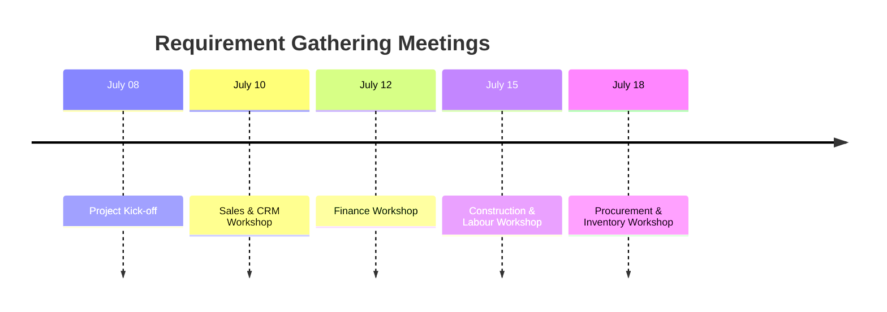
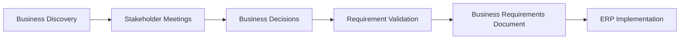
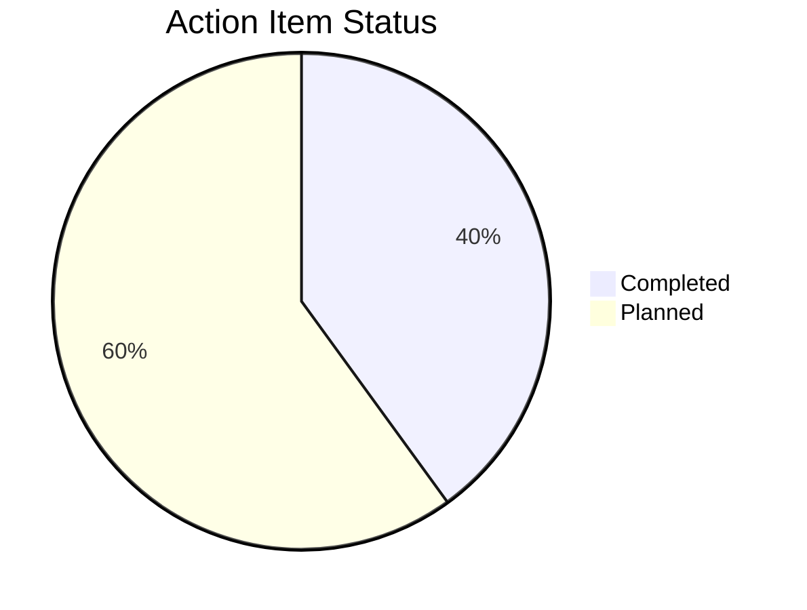

# Meeting Minutes (MoM)

> **Project:** Rajora ERP – Enterprise Residential Construction Management System  
> **Company:** Rajora Infra Homes  
> **Document ID:** MOM-001  
> **Version:** 1.0  
> **Prepared By:** Shikha Phogat – Business Analyst  
> **Date:** July 2026  
> **Document Status:** Final

---

# Document Overview

This document records the key discussions, business observations, decisions, and action items captured during stakeholder meetings conducted throughout the **Business Discovery** and **Requirement Elicitation** phases of the Rajora ERP implementation project.

The meeting minutes provide a formal record of stakeholder feedback, ensure traceability of business decisions, and serve as supporting documentation for subsequent project deliverables including the **Business Requirements Document (BRD)**, **Functional Requirements Document (FRD)**, **User Stories**, and **Process Models**.

---

# Table of Contents

- [1. Purpose](#1-purpose)
- [2. Meeting 1 – Project Kick-off](#2-meeting-1--project-kick-off)
- [3. Meeting 2 – Sales & CRM Requirements](#3-meeting-2--sales--crm-requirements)
- [4. Meeting 3 – Finance Requirements](#4-meeting-3--finance-requirements)
- [5. Meeting 4 – Construction & Labour Requirements](#5-meeting-4--construction--labour-requirements)
- [6. Meeting 5 – Procurement & Inventory Requirements](#6-meeting-5--procurement--inventory-requirements)
- [7. Key Decisions](#7-key-decisions)
- [8. Action Item Summary](#8-action-item-summary)
- [9. Next Steps](#9-next-steps)
- [Document Approval](#document-approval)

---

# 1. Purpose

The purpose of this document is to formally capture discussions, business observations, decisions, and action items identified during stakeholder meetings conducted throughout the Business Discovery and Requirement Elicitation phases of the **Rajora ERP** implementation.

These meeting minutes establish a traceable record of stakeholder inputs, business expectations, and agreed actions, ensuring transparency throughout the analysis process and providing valuable reference material for preparing the **Business Requirements Document (BRD)**.

---

## Objectives of Meeting Documentation

| Objective | Description |
|------------|-------------|
| Record Discussions | Capture important conversations and stakeholder feedback |
| Document Decisions | Maintain an official record of business decisions |
| Track Action Items | Assign ownership and monitor progress |
| Ensure Requirement Traceability | Link discussions to future project deliverables |
| Improve Collaboration | Maintain alignment among stakeholders |

> **Business Analyst Note**
>
> Well-maintained Meeting Minutes improve stakeholder alignment, reduce misunderstandings, and provide an auditable history of decisions made throughout the ERP implementation lifecycle.

---

## Meeting Timeline

---

# 2. Meeting 1 – Project Kick-off

## Meeting Information

| Item | Details |
|------|---------|
| **Meeting ID** | MOM-001 |
| **Meeting Date** | 08 July 2026 |
| **Department** | Executive Management |
| **Facilitator** | Business Analyst |
| **Duration** | 90 Minutes |
| **Meeting Type** | Project Kick-off |

---

## Participants

| Participant | Role |
|-------------|------|
| Managing Director | Project Sponsor |
| CEO | Executive Sponsor |
| Business Analyst | Facilitator & Requirements Analyst |

---

## Meeting Agenda

- Understand current business operations.
- Discuss project objectives.
- Identify existing operational challenges.
- Define the ERP vision.
- Identify key stakeholders.

---

## Discussion Summary

During the kick-off meeting, executive management provided an overview of the organization's existing operational practices and highlighted the major business challenges driving the ERP initiative.

The discussion focused on the current dependence on spreadsheets, manual reporting processes, fragmented customer information, and the need for centralized operational visibility.

### Key Observations

| Observation | Business Impact |
|-------------|-----------------|
| Business operations rely on multiple Excel files | Data duplication and version control issues |
| Reports are prepared manually | Increased reporting effort and delays |
| Customer information exists in multiple files | Inconsistent customer records |
| Construction progress lacks real-time visibility | Delayed management decisions |
| Purchase approvals are manual | Longer procurement cycle |
| Labour attendance is maintained in paper registers | Manual wage processing |
| Inventory updates are delayed | Poor stock visibility |
| Executive dashboards are unavailable | Limited operational insights |
| Management requires centralized reporting | Need for integrated ERP platform |

---

## Key Decisions

| Decision ID | Decision |
|-------------|----------|
| D-001 | Implement a centralized ERP solution. |
| D-002 | Digitize manual business processes. |
| D-003 | Replace Excel-based reporting. |
| D-004 | Standardize departmental workflows. |

---

## Action Items

| Action ID | Action | Owner | Target Status |
|-----------|--------|-------|---------------|
| A-001 | Document current business processes | Business Analyst | Completed |
| A-002 | Identify participating departments | Business Analyst | Completed |
| A-003 | Schedule stakeholder interviews | Business Analyst | Completed |

---

## Meeting Outcome

✅ Current business processes documented

✅ ERP vision established

✅ Executive sponsorship confirmed

✅ Major operational challenges identified

✅ Stakeholder identification completed

✅ Business Discovery phase initiated

---

## Business Insight

> The Project Kick-off meeting established a shared understanding of the organization's current challenges and defined the strategic direction for the Rajora ERP initiative. Executive management emphasized the need for a centralized platform capable of integrating departmental operations, improving reporting, and enabling data-driven decision-making across the organization.

---
---

# 3. Meeting 2 – Sales & CRM Requirements

## Meeting Information

| Item | Details |
|------|---------|
| **Meeting ID** | MOM-002 |
| **Department** | Sales & Customer Relationship Management (CRM) |
| **Facilitator** | Business Analyst |
| **Duration** | 120 Minutes |
| **Meeting Type** | Functional Requirements Workshop |

---

## Participants

| Participant | Role |
|-------------|------|
| Sales Manager | Department Head |
| CRM Executive | Business User |
| Business Analyst | Facilitator & Requirements Analyst |

---

## Meeting Agenda

- Understand the lead management process.
- Review the property booking workflow.
- Analyze customer communication practices.
- Identify reporting and dashboard requirements.

---

## Discussion Summary

The Sales and CRM workshop focused on understanding the complete customer acquisition lifecycle—from lead generation to property booking—and identifying opportunities to improve customer engagement through automation.

Stakeholders highlighted the challenges caused by maintaining customer information across multiple Excel files and emphasized the need for centralized customer management.

### Key Observations

| Observation | Business Impact |
|-------------|-----------------|
| Leads originate from digital campaigns, referrals, and walk-ins | Multiple lead sources require centralized tracking |
| Lead assignment is performed manually | Delayed response to prospective customers |
| Customer follow-ups are maintained in Excel | Missed follow-ups and inconsistent communication |
| Booking records are maintained separately | Duplicate customer information |
| Customer communication history is fragmented | Incomplete customer visibility |
| Reminder tracking is manual | Missed payment and follow-up reminders |
| Sales reports require manual consolidation | Delayed management reporting |
| Customers frequently request payment updates | Increased dependency on manual communication |

---

## Key Decisions

| Decision ID | Decision |
|-------------|----------|
| D-005 | Implement a centralized Lead Management Module. |
| D-006 | Maintain a single Customer Master for all departments. |
| D-007 | Introduce automated follow-up reminders. |
| D-008 | Store complete customer interaction history. |
| D-009 | Develop an interactive Sales Dashboard. |

---

## Action Items

| Action ID | Action | Owner | Status |
|-----------|--------|-------|--------|
| A-004 | Document the complete Sales workflow | Business Analyst | Planned |
| A-005 | Prepare Customer Management requirements | Business Analyst | Planned |
| A-006 | Define Sales Dashboard KPIs | Business Analyst | Planned |

---

## Meeting Outcome

✅ Lead management process documented

✅ Customer communication challenges identified

✅ CRM automation requirements finalized

✅ Reporting expectations captured

✅ Sales Dashboard requirements approved

---

## Business Insight

> The workshop confirmed that Sales and CRM operations would benefit significantly from a centralized customer database, automated follow-up reminders, and real-time visibility into customer interactions, bookings, and sales performance.

---

# 4. Meeting 3 – Finance Requirements

## Meeting Information

| Item | Details |
|------|---------|
| **Meeting ID** | MOM-003 |
| **Department** | Finance |
| **Facilitator** | Business Analyst |
| **Duration** | 90 Minutes |
| **Meeting Type** | Functional Requirements Workshop |

---

## Participants

| Participant | Role |
|-------------|------|
| Finance Manager | Department Head |
| Accounts Executive | Business User |
| Business Analyst | Facilitator & Requirements Analyst |

---

## Meeting Agenda

- Review the customer payment process.
- Understand accounting workflows.
- Discuss finance reporting requirements.
- Identify automation opportunities.

---

## Discussion Summary

The Finance workshop focused on understanding payment processing, receipt generation, GST calculations, outstanding balance management, and financial reporting.

Stakeholders emphasized that most financial activities depend heavily on spreadsheets, resulting in manual reconciliation, delayed reporting, and increased effort.

### Key Observations

| Observation | Business Impact |
|-------------|-----------------|
| Customer payments are maintained in Excel | Increased manual effort |
| GST calculations are performed manually | Risk of calculation errors |
| Outstanding balances require manual reconciliation | Delayed collection follow-ups |
| Receipts are generated manually | Time-consuming payment processing |
| Refund approvals require management intervention | Longer approval cycle |
| Collection reports are prepared weekly | Limited real-time financial visibility |

---

## Key Decisions

| Decision ID | Decision |
|-------------|----------|
| D-010 | Implement a centralized Finance Module. |
| D-011 | Automate receipt generation. |
| D-012 | Automate GST calculation. |
| D-013 | Generate automated outstanding payment reports. |
| D-014 | Develop an interactive Finance Dashboard. |

---

## Action Items

| Action ID | Action | Owner | Status |
|-----------|--------|-------|--------|
| A-007 | Prepare Finance Module requirements | Business Analyst | Planned |
| A-008 | Define finance approval workflow | Finance Manager | Planned |
| A-009 | Identify Finance KPIs for dashboard | Business Analyst | Planned |

---

## Meeting Outcome

✅ Finance workflow documented

✅ Payment management process analyzed

✅ Automation opportunities identified

✅ Dashboard requirements finalized

✅ Finance module scope approved

---

## Business Insight

> The Finance team emphasized the importance of automating payment processing, GST calculations, receipt generation, and outstanding payment tracking to improve operational efficiency and provide management with accurate, real-time financial information.

---

---

# 5. Meeting 4 – Construction & Labour Requirements

## Meeting Information

| Item | Details |
|------|---------|
| **Meeting ID** | MOM-004 |
| **Department** | Construction & Labour Management |
| **Facilitator** | Business Analyst |
| **Duration** | 120 Minutes |
| **Meeting Type** | Functional Requirements Workshop |

---

## Participants

| Participant | Role |
|-------------|------|
| Project Manager | Department Head |
| Site Engineer | Business User |
| Site Supervisor | Business User |
| Labour Supervisor | Business User |
| Business Analyst | Facilitator & Requirements Analyst |

---

## Meeting Agenda

- Understand project execution lifecycle.
- Review construction progress reporting.
- Analyze labour attendance and wage management.
- Identify reporting and dashboard requirements.

---

## Discussion Summary

The workshop focused on understanding how construction activities are planned, monitored, and reported across project sites. Discussions also covered labour deployment, attendance management, wage calculations, and operational reporting.

Stakeholders highlighted that most operational activities are still managed manually, making it difficult to monitor project progress and workforce productivity in real time.

### Key Observations

| Observation | Business Impact |
|-------------|-----------------|
| Construction progress is reported manually | Delayed project visibility |
| Engineers submit updates through WhatsApp and Excel | Fragmented project information |
| Labour attendance is maintained in paper registers | Time-consuming wage calculations |
| Wage calculations are manual | Increased risk of payroll errors |
| Construction delays are identified late | Delayed corrective actions |
| Material shortages affect construction schedules | Reduced project efficiency |

---

## Key Decisions

| Decision ID | Decision |
|-------------|----------|
| D-015 | Implement Construction Management Module. |
| D-016 | Digitize labour attendance. |
| D-017 | Track construction progress stage-wise. |
| D-018 | Develop Labour Performance Dashboard. |
| D-019 | Build Construction Progress Dashboard. |

---

## Action Items

| Action ID | Action | Owner | Status |
|-----------|--------|-------|--------|
| A-010 | Document construction workflow | Business Analyst | Planned |
| A-011 | Prepare Labour Module requirements | Business Analyst | Planned |
| A-012 | Identify construction milestones | Project Manager | Planned |

---

## Meeting Outcome

✅ Construction workflow documented

✅ Labour management process analyzed

✅ Progress tracking requirements finalized

✅ Dashboard requirements approved

✅ Construction module scope confirmed

---

## Business Insight

> The Construction and Labour workshop confirmed the need for real-time project monitoring, digital workforce management, and stage-wise progress tracking to improve execution efficiency and reduce reporting delays.

---

# 6. Meeting 5 – Procurement & Inventory Requirements

## Meeting Information

| Item | Details |
|------|---------|
| **Meeting ID** | MOM-005 |
| **Department** | Procurement & Inventory |
| **Facilitator** | Business Analyst |
| **Duration** | 90 Minutes |
| **Meeting Type** | Functional Requirements Workshop |

---

## Participants

| Participant | Role |
|-------------|------|
| Procurement Manager | Department Head |
| Store Manager | Business User |
| Business Analyst | Facilitator & Requirements Analyst |

---

## Meeting Agenda

- Understand purchasing workflow.
- Review inventory management process.
- Discuss approval hierarchy.
- Identify reporting requirements.

---

## Discussion Summary

The Procurement and Inventory workshop focused on material purchasing, vendor management, inventory control, and approval workflows.

Stakeholders emphasized that procurement activities depend heavily on manual approvals and spreadsheet-based tracking, making purchasing and stock monitoring inefficient.

### Key Observations

| Observation | Business Impact |
|-------------|-----------------|
| Material requests are raised manually | Delayed procurement process |
| Vendor quotations are compared in Excel | Limited vendor visibility |
| Purchase Orders require manual approval | Longer approval cycle |
| Inventory balances are updated after delivery | Delayed stock visibility |
| Stock shortages are difficult to identify | Increased procurement risk |
| Vendor performance is not measured | Difficult supplier evaluation |

---

## Key Decisions

| Decision ID | Decision |
|-------------|----------|
| D-020 | Implement Purchase Request Workflow. |
| D-021 | Automate Purchase Order approvals. |
| D-022 | Introduce Vendor Management Module. |
| D-023 | Implement Inventory Management Module. |
| D-024 | Generate automated Stock Alert reports. |

---

## Action Items

| Action ID | Action | Owner | Status |
|-----------|--------|-------|--------|
| A-013 | Document procurement workflow | Business Analyst | Planned |
| A-014 | Define inventory reporting requirements | Store Manager | Planned |
| A-015 | Prepare Vendor Management requirements | Business Analyst | Planned |

---

## Meeting Outcome

✅ Procurement workflow documented

✅ Inventory management process analyzed

✅ Vendor management requirements finalized

✅ Approval workflow confirmed

✅ Inventory reporting requirements approved

---

## Business Insight

> The workshop identified centralized procurement, automated approval workflows, inventory monitoring, and vendor performance tracking as critical capabilities required to improve supply chain efficiency.

---

# 7. Key Decisions

The following strategic decisions were approved across all stakeholder meetings.

| Decision ID | Approved Decision |
|-------------|-------------------|
| D-001 | ERP will replace Excel-based operations. |
| D-002 | Sales, CRM, Finance, Construction, Procurement, Inventory, and Labour modules will be included in Phase 1. |
| D-003 | Executive dashboards will provide real-time KPI visibility. |
| D-004 | Manual approval workflows will be digitized. |
| D-005 | Customer, Vendor, and Inventory information will be centralized. |
| D-006 | Standardized reports will be generated automatically. |

---

## Decision Flow

---

# 8. Action Item Summary

The following action items were agreed upon during the Discovery and Requirement Elicitation phases.

| Action ID | Action | Owner | Status |
|-----------|--------|-------|--------|
| A-001 | Complete Business Discovery | Business Analyst | Completed |
| A-002 | Prepare Requirement Elicitation Document | Business Analyst | Completed |
| A-003 | Create Business Process Maps | Business Analyst | Planned |
| A-004 | Prepare Business Requirements Document (BRD) | Business Analyst | Planned |
| A-005 | Validate requirements with stakeholders | Project Sponsor | Planned |

---

## Action Status Overview

---

# 9. Next Steps

Following completion of the Discovery and Requirement Elicitation phases, the project will proceed with the following activities.

| Phase | Activity |
|-------|----------|
| Phase 1 | Finalize stakeholder requirements |
| Phase 2 | Prepare Business Requirements Document (BRD) |
| Phase 3 | Define detailed Functional Requirements (FRD) |
| Phase 4 | Create Business Process Maps |
| Phase 5 | Develop User Stories |
| Phase 6 | Design Wireframes |
| Phase 7 | Prepare Database Design |
| Phase 8 | Define Reporting & Dashboard Requirements |

---

## Project Roadmap

---

# Document Approval

| Role | Name | Status |
|------|------|--------|
| Business Analyst | Shikha Phogat | Approved |
| Project Sponsor | Managing Director Vishutosh Singh | Pending |

---

## Related Documents

| Document | Purpose |
|----------|---------|
| Business Discovery Notes | Current-state analysis and business context |
| Requirement Elicitation Document (RED) | Stakeholder requirements and elicitation findings |
| Business Requirements Document (BRD) | Detailed business requirements |
| Functional Requirements Document (FRD) | System functionality specification |
| Stakeholder Register | Stakeholder roles and responsibilities |
| Requirement Traceability Matrix (RTM) | End-to-end requirement tracking |

---

> **Document Status:** Final

**Version:** 1.0  
**Prepared By:** Shikha Phogat – Business Analyst  
**Project:** Rajora ERP – Enterprise Residential Construction Management System

---

