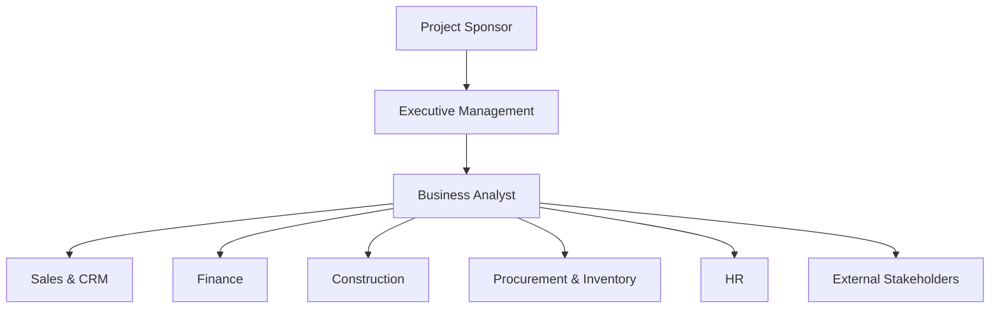
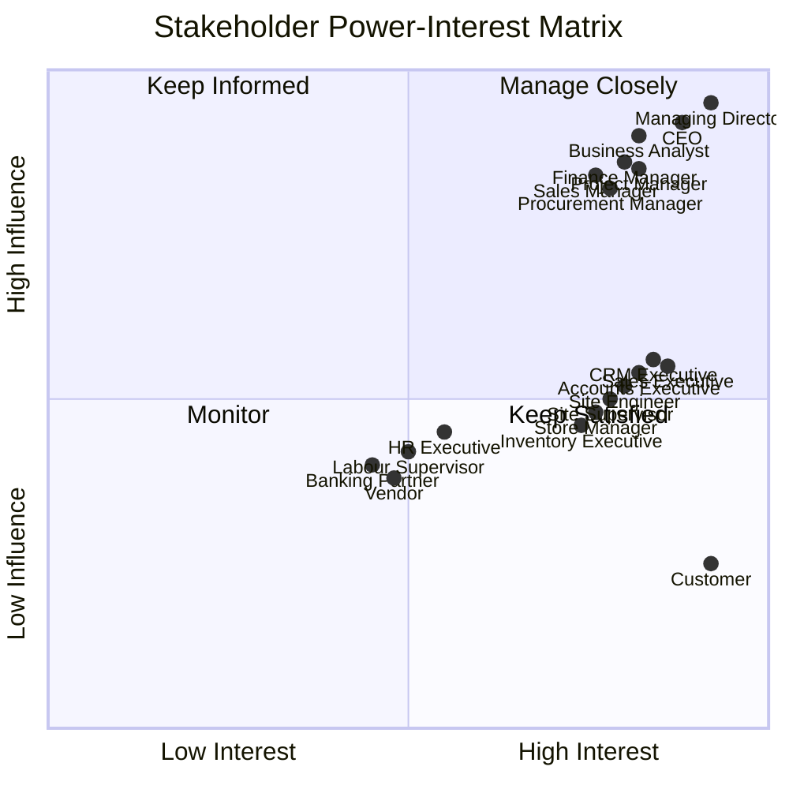
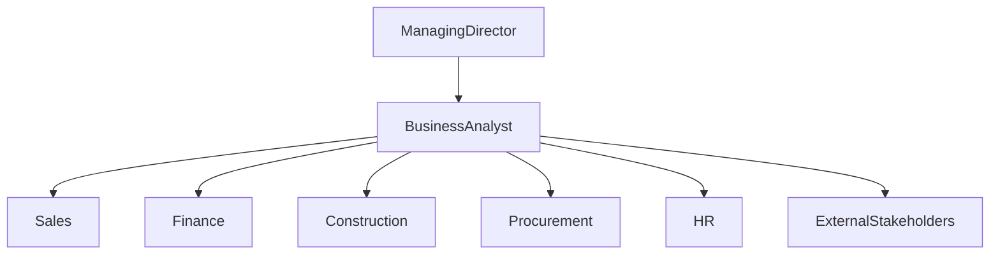
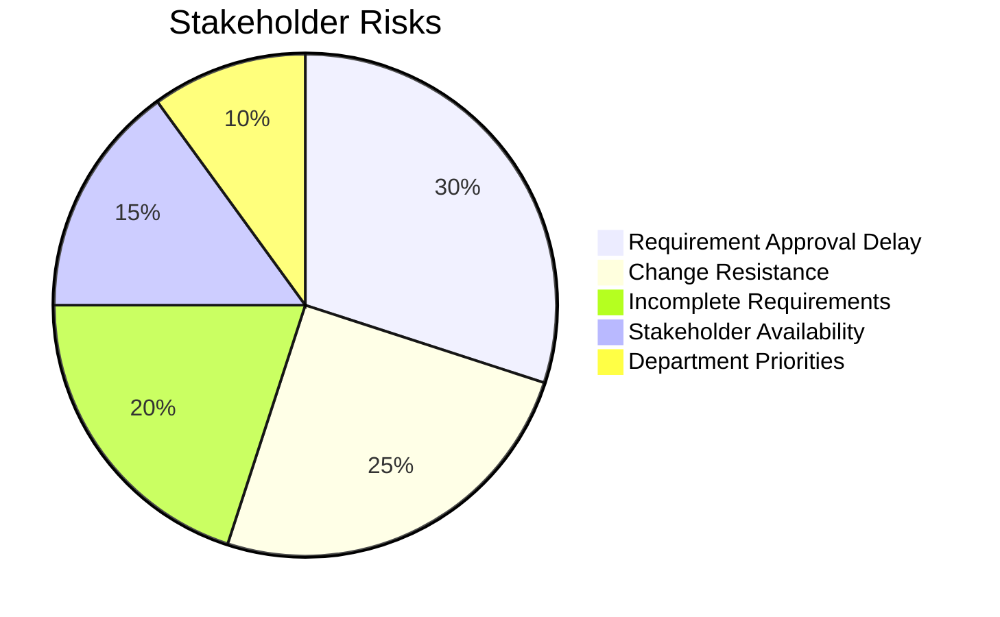

# Stakeholder Register

> **Project:** Rajora ERP – Enterprise Residential Construction Management System  
> **Company:** Rajora Infra Homes  
> **Document ID:** SR-001  
> **Version:** 1.0  
> **Prepared By:** Shikha Phogat – Business Analyst  
> **Prepared For:** Rajora Infra Homes Management  
> **Date:** July 2026  
> **Document Status:** Final

---

# Document Overview

This document identifies the stakeholders involved in the Rajora ERP implementation project and defines their roles, responsibilities, communication requirements, and level of involvement throughout the project.

The Stakeholder Register acts as a central reference during requirement gathering, requirement validation, user acceptance testing, and project implementation.

---

# Table of Contents

- [1. Purpose](#1-purpose)
- [2. Stakeholder Identification](#2-stakeholder-identification)
- [3. Stakeholder Register](#3-stakeholder-register)
- [4. Stakeholder Classification](#4-stakeholder-classification)
- [5. RACI Matrix](#5-raci-matrix)
- [6. Stakeholder Communication Plan](#6-stakeholder-communication-plan)
- [7. Stakeholder Engagement Strategy](#7-stakeholder-engagement-strategy)
- [8. Stakeholder Risk Assessment](#8-stakeholder-risk-assessment)
- [9. Conclusion](#9-conclusion)
- [Document Approval](#document-approval)

---

# 1. Purpose

The purpose of this Stakeholder Register is to identify all individuals and departments participating in the Rajora ERP implementation project.

It defines each stakeholder's responsibilities, level of involvement, communication needs, and role during the project lifecycle. This document helps ensure that the right people are consulted during requirement gathering, design discussions, testing, and implementation.

---

## Objectives

- Identify project stakeholders.
- Define stakeholder roles and responsibilities.
- Establish communication channels.
- Support requirement validation.
- Improve collaboration throughout the ERP implementation.

> **Business Analyst Note**
>
> Since Rajora Infra Homes is a growing construction company, active involvement of department heads and business users is essential to ensure the ERP system reflects day-to-day business operations.

---

# 2. Stakeholder Identification

The Rajora ERP project involves stakeholders from management, business departments, site operations, and external business partners.

---

## Internal Stakeholders

| Stakeholder | Primary Responsibility |
|-------------|------------------------|
| Managing Director | Project sponsor and final approvals |
| CEO | Business decisions and project oversight |
| Business Analyst | Requirement gathering, documentation, stakeholder coordination |
| Sales Manager | Sales and booking process requirements |
| Sales Executives | Lead management and customer follow-ups |
| CRM Executive | Customer communication and document management |
| Finance Manager | Finance process and payment approvals |
| Accounts Executive | Receipts, collections, and reconciliation |
| Project Manager | Construction planning and project monitoring |
| Site Engineer | Site execution and daily progress updates |
| Site Supervisor | Labour supervision and site coordination |
| Labour Supervisor | Attendance and workforce management |
| HR Executive | Employee and labour records |
| Procurement Manager | Purchasing and vendor approvals |
| Purchase Executive | Purchase orders and quotations |
| Store Manager | Material stock management |
| Inventory Executive | Material receipts and issues |

---

## External Stakeholders

| Stakeholder | Primary Responsibility |
|-------------|------------------------|
| Customers | Property booking and payments |
| Vendors | Material supply |
| Banking Partners | Customer home loan processing |
| Government Authorities | Regulatory compliance (RERA, Municipal Bodies) |

---

## Stakeholder Groups

---

## Key Observation

The Rajora ERP implementation involves a relatively small group of stakeholders, making direct communication and faster decision-making possible. Department heads act as primary business representatives, while operational users provide detailed process inputs during requirement gathering and testing.

---
---

# 3. Stakeholder Register

The following register identifies the key stakeholders involved in the Rajora ERP implementation. It outlines their responsibilities, influence on the project, communication method, and expected level of participation.

| ID | Stakeholder | Department | Role | Influence | Interest | Responsibilities | Communication Method | Frequency |
|----|-------------|------------|------|-----------|----------|------------------|----------------------|-----------|
| ST-001 | Managing Director | Executive | Project Sponsor | High | High | Project approvals, budget, strategic decisions | Review Meeting | Monthly |
| ST-002 | CEO | Executive | Business Sponsor | High | High | Business decisions and project oversight | Review Meeting | Weekly |
| ST-003 | Business Analyst | PMO | Requirements Owner | High | High | Requirement gathering, documentation, stakeholder coordination | Daily Meetings | Daily |
| ST-004 | Sales Manager | Sales | Business User | High | High | Sales workflow and booking process | Workshops | Weekly |
| ST-005 | Sales Executive | Sales | End User | Medium | High | Lead management and customer follow-ups | Team Meeting | Weekly |
| ST-006 | CRM Executive | CRM | Business User | Medium | High | Customer communication and document management | Workshops | Weekly |
| ST-007 | Finance Manager | Finance | Business User | High | High | Financial approvals, collections, reporting | Review Meeting | Weekly |
| ST-008 | Accounts Executive | Finance | End User | Medium | High | Payment entries, receipts and reconciliation | Daily Discussion | Daily |
| ST-009 | Project Manager | Construction | Business User | High | High | Construction planning and project monitoring | Weekly Review | Weekly |
| ST-010 | Site Engineer | Construction | End User | Medium | High | Daily site updates and progress reporting | Site Meeting | Daily |
| ST-011 | Site Supervisor | Construction | End User | Medium | High | Labour supervision and execution | Site Meeting | Daily |
| ST-012 | Labour Supervisor | Operations | End User | Medium | Medium | Labour attendance and deployment | Site Meeting | Daily |
| ST-013 | HR Executive | HR | Business User | Medium | Medium | Labour records and payroll support | HR Meeting | Weekly |
| ST-014 | Procurement Manager | Procurement | Business User | High | High | Purchasing and vendor approvals | Department Meeting | Weekly |
| ST-015 | Purchase Executive | Procurement | End User | Medium | High | Purchase Orders and quotations | Team Meeting | Weekly |
| ST-016 | Store Manager | Inventory | Business User | Medium | High | Inventory management | Inventory Review | Weekly |
| ST-017 | Inventory Executive | Inventory | End User | Medium | High | Material receipts and stock updates | Daily Update | Daily |
| ST-018 | Customer | External | Customer | Low | High | Property booking and payments | Email / Phone | As Required |
| ST-019 | Vendor | External | Supplier | Medium | Medium | Material supply | Email | As Required |
| ST-020 | Banking Partner | External | Financial Partner | Medium | Medium | Home loan processing | Email / Meeting | As Required |

---

## Stakeholder Summary

| Category | Number of Stakeholders |
|----------|-----------------------:|
| Executive Management | 2 |
| Business Users | 8 |
| Operational / End Users | 7 |
| External Stakeholders | 3 |

> **Business Insight**
>
> Most project decisions are expected to come from department heads and the Managing Director, while operational users play a key role in validating existing business processes and testing the ERP system during User Acceptance Testing (UAT).

---

# 4. Stakeholder Classification

To ensure effective communication and engagement, stakeholders have been classified according to their level of influence and interest in the project.

## High Influence • High Interest

These stakeholders are actively involved in project decisions and requirement approvals.

| Stakeholder |
|-------------|
| Managing Director |
| CEO |
| Business Analyst |
| Sales Manager |
| Finance Manager |
| Project Manager |
| Procurement Manager |

---

## Medium Influence • High Interest

These stakeholders provide business inputs, validate requirements, and participate in testing.

| Stakeholder |
|-------------|
| Sales Executive |
| CRM Executive |
| Accounts Executive |
| Site Engineer |
| Site Supervisor |
| Store Manager |
| Inventory Executive |

---

## Medium Influence • Medium Interest

These stakeholders support departmental operations and provide functional inputs when required.

| Stakeholder |
|-------------|
| HR Executive |
| Labour Supervisor |
| Vendor |
| Banking Partner |

---

## Low Influence • High Interest

These stakeholders are directly affected by the ERP system but are not involved in project decisions.

| Stakeholder |
|-------------|
| Customers |

---

## Stakeholder Priority Matrix

---

### Stakeholder Engagement Approach

| Stakeholder Category | Engagement Approach |
|----------------------|---------------------|
| High Influence / High Interest | Involve in requirement reviews, major decisions and milestone approvals |
| Medium Influence / High Interest | Conduct workshops, requirement validation sessions and UAT |
| Medium Influence / Medium Interest | Keep informed through departmental meetings and project updates |
| Low Influence / High Interest | Provide timely communication regarding activities affecting them |

> **Key Observation**
>
> Due to the relatively small size of Rajora Infra Homes, communication between stakeholders is direct and collaborative. Most requirement discussions involve department heads and the Business Analyst, enabling faster decision-making and shorter feedback cycles compared to larger enterprise implementations.

---
---

# 5. RACI Matrix

The RACI Matrix defines the level of involvement of key stakeholders for major project activities.

| Project Activity | MD | CEO | BA | Sales | Finance | Project Manager | Procurement | Store | HR |
|------------------|:--:|:--:|:--:|:-----:|:-------:|:---------------:|:-----------:|:-----:|:--:|
| Business Discovery | A | C | R | C | C | C | C | I | I |
| Requirement Gathering | I | C | R | R | R | R | R | C | C |
| Requirement Validation | A | C | R | C | C | C | C | I | I |
| BRD Preparation | I | I | R | C | C | C | C | I | I |
| User Acceptance Testing (UAT) | I | I | R | R | R | R | R | R | C |
| Go-Live Approval | A | C | C | I | I | I | I | I | I |

### RACI Legend

| Code | Meaning |
|------|---------|
| **R** | Responsible – Performs the activity |
| **A** | Accountable – Final decision maker |
| **C** | Consulted – Provides inputs |
| **I** | Informed – Kept updated |

> **Business Analyst Note**
>
> The Business Analyst is responsible for coordinating most requirement-related activities, while the Managing Director provides final approvals for major project deliverables.

---

# 6. Stakeholder Communication Plan

Effective communication is essential to keep stakeholders informed and ensure timely project decisions.

| Stakeholder | Information Shared | Communication Method | Frequency | Owner |
|-------------|-------------------|----------------------|-----------|-------|
| Managing Director | Project progress, key risks, approvals | Review Meeting | Monthly | Business Analyst |
| CEO | Weekly progress and pending decisions | Review Meeting | Weekly | Business Analyst |
| Sales Manager | Sales module updates | Workshop | Weekly | Business Analyst |
| Finance Manager | Finance requirements and process updates | Review Meeting | Weekly | Business Analyst |
| Project Manager | Construction module progress | Project Meeting | Weekly | Business Analyst |
| Procurement Manager | Procurement module updates | Department Meeting | Weekly | Business Analyst |
| Store Manager | Inventory process updates | Team Meeting | Weekly | Business Analyst |
| Customers | Booking and payment updates | Email / Phone | As Required | CRM Executive |
| Vendors | Purchase Orders and delivery updates | Email | As Required | Procurement Executive |

---

## Communication Flow

---

# 7. Stakeholder Engagement Strategy

The engagement strategy defines how different stakeholder groups will participate during the ERP implementation.

| Stakeholder Group | Engagement Approach |
|-------------------|---------------------|
| Executive Management | Regular project reviews, milestone approvals, and progress updates |
| Department Heads | Requirement workshops, solution discussions, and requirement validation |
| End Users | Process walkthroughs, UAT sessions, and user training |
| External Stakeholders | Communication as required for approvals, procurement, and customer services |

---

## Engagement Across Project Phases

| Project Phase | Primary Stakeholders |
|---------------|---------------------|
| Business Discovery | Managing Director, CEO, Business Analyst |
| Requirement Gathering | Business Analyst, Department Heads, End Users |
| Solution Design | Business Analyst, Department Heads |
| User Acceptance Testing | Business Users, End Users |
| Go-Live | Management, Business Analyst, Department Heads |

> **Key Observation**
>
> Since Rajora Infra Homes has a lean organizational structure, stakeholders can participate directly in workshops and review meetings. This allows faster requirement validation and quicker decision-making throughout the project.

---

# 8. Stakeholder Risk Assessment

The following risks related to stakeholder participation were identified during the planning phase.

| Risk | Impact | Mitigation Strategy |
|------|--------|---------------------|
| Delay in requirement approvals | High | Schedule review meetings in advance and obtain timely sign-offs |
| Resistance to adopting the ERP system | High | Conduct demonstrations and user training sessions |
| Limited stakeholder availability | Medium | Share meeting agendas in advance and plan sessions early |
| Conflicting departmental priorities | Medium | Discuss issues with management and reach a common decision |
| Incomplete business requirements | High | Validate requirements through workshops and review meetings |

---

## Risk Overview

---

# 9. Conclusion

The Stakeholder Register provides a structured view of all individuals and departments involved in the Rajora ERP implementation project.

By clearly defining stakeholder roles, responsibilities, communication methods, and engagement strategies, the project team can ensure effective collaboration, timely decision-making, and successful implementation of the ERP system.

This document will be reviewed periodically and updated whenever new stakeholders are identified or project responsibilities change.

---

# Document Approval

| Role | Name | Status |
|------|------|--------|
| Business Analyst | Shikha Phogat | Approved |
| Project Sponsor | Managing Director Vishutosh Singh | Pending |

---

# Related Documents

| Document | Purpose |
|----------|---------|
| Business Discovery Notes | Understand current business operations and challenges |
| Requirement Elicitation Document | Capture stakeholder requirements |
| Meeting Minutes (MoM) | Record discussions and project decisions |
| Business Requirements Document (BRD) | Define detailed business requirements |
| Functional Requirements Document (FRD) | Describe system functionality |
| Requirement Traceability Matrix (RTM) | Track requirements across the project lifecycle |

---

> **Document Status:** Final

**Version:** 1.0  
**Prepared By:** Shikha Phogat – Business Analyst  
**Project:** Rajora ERP – Enterprise Residential Construction Management System

---

