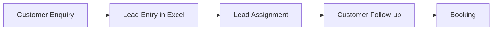
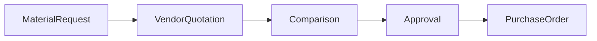
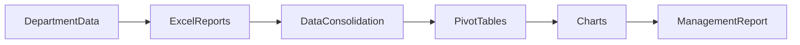
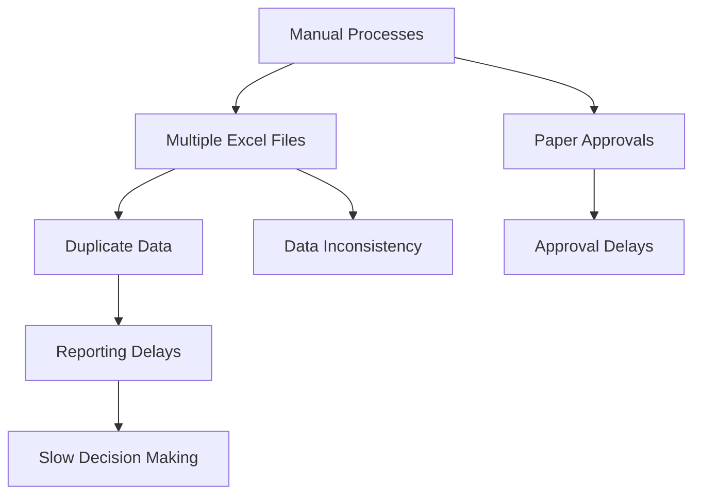

# AS-IS Process Analysis

> **Project:** Rajora ERP – Enterprise Residential Construction Management System  
> **Company:** Rajora Infra Homes  
> **Document ID:** ASIS-001  
> **Version:** 1.0  
> **Prepared By:** Shikha Phogat – Business Analyst  
> **Prepared For:** Rajora Infra Homes Management  
> **Date:** July 2026  
> **Document Status:** Final

---

# Document Overview

This document analyzes the existing ("AS-IS") business processes followed by Rajora Infra Homes before the implementation of the ERP system.

The analysis focuses on understanding how different departments currently perform their daily operations, the tools they use, the challenges they face, and the areas where business processes can be improved.

The findings from this document will serve as the foundation for the **TO-BE Process Analysis**, **Gap Analysis**, and **Business Requirements Document (BRD)**.

---

# Table of Contents

- [1. Purpose](#1-purpose)
- [2. Current Business Environment](#2-current-business-environment)
- [3. Current Business Processes](#3-current-business-processes)
- [4. Existing Systems](#4-existing-systems)
- [5. Current Data Flow](#5-current-data-flow)
- [6. Department-wise Process Analysis](#6-department-wise-process-analysis)
- [7. Current Approval Workflow](#7-current-approval-workflow)
- [8. Current Reporting Process](#8-current-reporting-process)
- [9. Current KPIs](#9-current-kpis)
- [10. Pain Point Analysis](#10-pain-point-analysis)
- [11. Root Cause Analysis](#11-root-cause-analysis)
- [12. Process Bottlenecks](#12-process-bottlenecks)
- [13. SWOT Analysis](#13-swot-analysis)
- [14. Business Risks](#14-business-risks)
- [15. Improvement Opportunities](#15-improvement-opportunities)
- [16. Summary](#16-summary)
- [Document Approval](#document-approval)

---

# 1. Purpose

The purpose of this document is to understand and document the existing ("AS-IS") business processes followed by Rajora Infra Homes before implementing the ERP system.

The analysis helps identify manual activities, operational challenges, process inefficiencies, and communication gaps across departments. Understanding the current state allows the project team to design improved future processes that better support business operations.

---

## Objectives

- Understand existing business processes.
- Identify manual activities across departments.
- Document current tools and systems.
- Identify process inefficiencies and business challenges.
- Establish a baseline for designing future ("TO-BE") processes.

> **Business Analyst Note**
>
> Understanding the current way of working is the first step toward designing an ERP solution that improves efficiency without disrupting essential business operations.

---

# 2. Current Business Environment

Rajora Infra Homes currently manages its day-to-day business operations using a combination of Microsoft Excel spreadsheets, paper registers, email communication, WhatsApp messages, and manual approval processes.

Each department maintains its own records independently, resulting in duplicate data, inconsistent information, and delays in sharing updates across teams.

While these methods support daily operations, they make it difficult to obtain real-time visibility into sales, construction progress, inventory, labour, procurement, and financial activities.

---

## Current Working Environment

| Business Area | Current Practice |
|--------------|------------------|
| Customer Management | Excel spreadsheets |
| Sales Tracking | Excel |
| Labour Attendance | Paper registers |
| Construction Updates | Excel & WhatsApp |
| Procurement | Manual forms and Excel |
| Inventory | Excel registers |
| Finance | Excel ledgers |
| Reporting | Manual MIS reports |

---

## Key Observations

- Departments maintain separate records.
- Business data is duplicated across multiple Excel files.
- Information sharing depends on manual communication.
- Reports are prepared manually.
- Business decisions rely on delayed information.
- No centralized database is available.

---

# 3. Current Business Processes

The following table summarizes how major business functions are currently managed.

| Business Function | Current Method |
|-------------------|----------------|
| Lead Management | Excel |
| Customer Management | Excel |
| Booking Management | Excel |
| Loan Tracking | Excel |
| Customer Payments | Excel Ledger |
| Construction Tracking | Manual Reports |
| Labour Attendance | Attendance Register |
| Wage Calculation | Excel |
| Material Requests | Manual Forms |
| Purchase Orders | Excel |
| Inventory Management | Excel Register |
| Vendor Management | Excel |
| Management Reporting | Manual MIS Reports |

---

## Current Customer Journey

The following flow represents the typical customer journey followed by Rajora Infra Homes before ERP implementation.

> **Observation**
>
> Customer information is updated manually at each stage, requiring frequent coordination between Sales, CRM, Finance, and Construction teams.

---

# 4. Existing Systems

At present, Rajora Infra Homes does not use an integrated ERP solution. Different departments rely on commonly available software and manual records to perform their daily activities.

## Software Currently Used

| Software / Tool | Primary Usage |
|-----------------|---------------|
| Microsoft Excel | Operational records and reporting |
| Microsoft Word | Letters, agreements and documentation |
| Outlook Email | Internal and external communication |
| WhatsApp | Site updates and team communication |
| Printed Registers | Labour attendance and manual records |

---

## Business Data Storage

Business information is stored across multiple Excel files maintained by different departments.

Examples include:

- Customer Register
- Sales Register
- Labour Register
- Vendor Register
- Material Register
- Payment Ledger
- Expense Register

Since these files are maintained separately, there is no single source of truth for business information.

---

# 5. Current Data Flow

Business information moves manually between departments through Excel files, emails, and verbal communication.

---

## Current Data Flow Challenges

| Challenge | Business Impact |
|-----------|-----------------|
| Multiple Excel files | Duplicate information |
| Manual data transfer | Increased chances of errors |
| Department-wise data storage | Limited visibility across teams |
| Delayed updates | Slow decision-making |
| No centralized database | Difficult to track complete business information |

> **Key Observation**
>
> Since every department maintains its own records, information must be manually transferred between teams. This increases reporting effort, creates duplicate entries, and delays management's access to accurate business information.

---
---

# 6. Department-wise Process Analysis

The following section describes how each department currently performs its day-to-day activities and highlights the operational challenges observed during the Business Discovery phase.

---

## 6.1 Sales Department

### Current Process

1. Receive customer enquiries.
2. Record lead details in Excel.
3. Assign leads manually to sales executives.
4. Follow up through phone calls and WhatsApp.
5. Record customer bookings in Excel.

### Current Process Flow

### Current Challenges

| Observation | Business Impact |
|-------------|-----------------|
| Leads maintained in Excel | Duplicate records |
| Manual lead assignment | Delayed customer response |
| Follow-ups tracked manually | Missed opportunities |
| Booking records maintained separately | Inconsistent customer information |
| Sales reports prepared manually | Increased reporting effort |

---

## 6.2 CRM Department

### Current Process

1. Contact customers after booking.
2. Collect KYC documents.
3. Provide payment reminders.
4. Maintain customer communication records.
5. Handle customer queries.

### Current Challenges

| Observation | Business Impact |
|-------------|-----------------|
| Customer interactions are not centrally recorded | Incomplete customer history |
| Reminder tracking is manual | Missed payment reminders |
| Complaint history is unavailable | Difficult customer follow-up |
| Documents stored separately | Time spent searching records |

---

## 6.3 Finance Department

### Current Process

1. Record customer payments.
2. Calculate GST manually.
3. Generate receipts.
4. Update payment ledgers.
5. Prepare outstanding payment reports.

### Current Process Flow

### Current Challenges

| Observation | Business Impact |
|-------------|-----------------|
| Payments recorded manually | Increased data entry effort |
| GST calculations performed manually | Risk of calculation errors |
| Reconciliation takes time | Delayed financial reporting |
| Duplicate payment entries | Data inconsistency |

---

## 6.4 Construction Department

### Current Process

1. Receive project schedule.
2. Execute construction activities.
3. Engineers submit daily updates.
4. Progress recorded in Excel.
5. Management reviews project status.

### Current Challenges

| Observation | Business Impact |
|-------------|-----------------|
| Daily updates shared through WhatsApp and Excel | Information scattered across multiple sources |
| Progress tracking is manual | Difficult to monitor project status |
| Delays identified late | Slow corrective action |
| No centralized progress tracking | Limited management visibility |

---

## 6.5 Labour Management

### Current Process

1. Record labour attendance in registers.
2. Calculate daily wages.
3. Prepare wage sheet.
4. Process payments.

### Current Challenges

| Observation | Business Impact |
|-------------|-----------------|
| Attendance maintained on paper | Manual effort and possible errors |
| Wage calculations performed in Excel | Payroll delays |
| Labour productivity not measured | Difficult workforce planning |

---

## 6.6 Procurement Department

### Current Process

1. Receive material request.
2. Collect vendor quotations.
3. Compare quotations.
4. Obtain approval.
5. Issue Purchase Order.

### Current Process Flow

### Current Challenges

| Observation | Business Impact |
|-------------|-----------------|
| Purchase Requests created manually | Slower procurement process |
| Quotation comparison done in Excel | Time-consuming evaluation |
| Paper-based approvals | Approval delays |
| Purchase history difficult to track | Reduced purchasing visibility |

---

## 6.7 Inventory Department

### Current Process

1. Receive materials.
2. Update stock register.
3. Issue materials to project sites.
4. Conduct physical stock verification.

### Current Challenges

| Observation | Business Impact |
|-------------|-----------------|
| Stock updated manually | Delayed inventory information |
| Physical verification required | Additional operational effort |
| Material shortages identified late | Project delays |
| Inventory records not updated in real time | Inaccurate stock availability |

---

# 7. Current Approval Workflow

Most operational approvals are currently performed manually through paper documents, phone calls, or verbal confirmation.

## Observations

- Approval requests are handled manually.
- Approval status cannot be tracked easily.
- Purchase approvals may take longer during busy periods.
- Delays in approvals can affect material availability at project sites.

---

# 8. Current Reporting Process

Management receives operational reports from different departments on a regular basis.

### Current Reports

- Sales Report
- Customer Collection Report
- Inventory Report
- Construction Progress Report
- Labour Attendance Report
- Procurement Report

### Existing Reporting Process

### Observations

| Observation | Business Impact |
|-------------|-----------------|
| Reports prepared independently | Inconsistent reporting format |
| Data consolidated manually | Increased preparation time |
| Manual verification required | Higher possibility of errors |
| Reports are not available in real time | Delayed business decisions |

**Average Report Preparation Time:** **4–6 Hours**

---

# 9. Current KPIs

The management team currently tracks the following Key Performance Indicators (KPIs). These are calculated manually using Excel and departmental reports.

| Department | Current KPIs |
|------------|--------------|
| Sales | Leads Generated, Bookings, Conversion Rate |
| Finance | Customer Collections, Outstanding Payments |
| Construction | Project Progress, Milestones Completed |
| Labour | Attendance, Labour Cost |
| Procurement | Purchase Value, Vendor Performance |
| Inventory | Stock Balance, Material Consumption |

> **Key Observation**
>
> Although important business KPIs are tracked, they are calculated manually using Excel data collected from different departments. This makes reporting time-consuming and limits management's ability to monitor business performance in real time.

---
---

# 10. Pain Point Analysis

The Business Discovery and stakeholder discussions identified several operational challenges that affect efficiency, reporting, and decision-making across departments.

| Business Area | Pain Point | Business Impact |
|--------------|------------|-----------------|
| Sales | Duplicate lead records | Lost sales opportunities and inconsistent customer information |
| CRM | Manual follow-ups | Delayed customer communication and reduced customer satisfaction |
| Finance | Manual reconciliation | Delayed payment verification and reporting |
| Construction | No real-time progress tracking | Delayed identification of project issues |
| Labour | Manual attendance registers | Payroll errors and additional administrative effort |
| Procurement | Paper-based approvals | Slower purchasing process |
| Inventory | Stock mismatches | Material shortages and project delays |
| Reporting | Manual report preparation | Delayed business decisions |

> **Key Observation**
>
> Most operational challenges are caused by manual processes, disconnected Excel files, and the absence of a centralized system for managing business information.

---

# 11. Root Cause Analysis

The following table identifies the primary causes behind the issues observed during the AS-IS analysis.

| Problem | Root Cause |
|---------|------------|
| Duplicate business data | Multiple Excel files maintained by different departments |
| Delayed reports | Manual data consolidation |
| Approval delays | Paper-based approval process |
| Limited business visibility | No centralized database |
| Data inconsistency | Manual data entry across departments |
| Inventory mismatch | Delayed stock updates |

---

## Root Cause Summary

---

# 12. Process Bottlenecks

The following bottlenecks were identified during the analysis of current business operations.

- Manual data entry across departments
- Duplicate information maintained in multiple Excel files
- Paper-based approval process
- Slow report preparation
- No centralized customer records
- Limited visibility of project progress
- Delayed communication between departments
- Lack of workflow automation

---

## Process Bottlenecks Overview

| Bottleneck | Effect on Business |
|------------|-------------------|
| Manual data entry | Increased effort and higher risk of errors |
| Separate departmental records | Duplicate and inconsistent information |
| Manual approvals | Delayed purchasing and decision-making |
| Manual reporting | Reports take longer to prepare |
| Lack of centralized information | Difficult to monitor business performance |

---

# 13. SWOT Analysis

The SWOT analysis summarizes the current business environment and identifies areas that support future ERP implementation.

| Strengths | Weaknesses |
|-----------|------------|
| Experienced workforce | Heavy dependence on Excel |
| Established customer base | Manual business processes |
| Ongoing residential projects | Duplicate business data |
| Strong domain knowledge | Delayed reporting |

| Opportunities | Threats |
|---------------|---------|
| ERP implementation | Human errors |
| Process automation | Data inconsistency |
| Real-time reporting | Project delays due to manual coordination |
| Digital transformation | Resistance to process changes |

---

# 14. Business Risks

The following operational risks exist under the current working environment.

| Risk | Impact | Probability |
|------|:------:|:-----------:|
| Data inconsistency | High | High |
| Manual data entry errors | High | High |
| Delayed management reports | Medium | High |
| Customer dissatisfaction | High | Medium |
| Procurement delays | Medium | Medium |
| Inventory shortages | High | Medium |

---

## Risk Summary

> The majority of identified risks are directly related to manual data handling, fragmented business information, and delayed communication between departments.

---

# 15. Improvement Opportunities

Based on the AS-IS analysis, the following opportunities have been identified for improving business operations through ERP implementation.

| Improvement Area | Expected Benefit |
|------------------|------------------|
| Centralized ERP database | Single source of business information |
| Automated approval workflows | Faster decision-making |
| Digital labour attendance | Improved payroll accuracy |
| Integrated inventory management | Better stock visibility |
| Automated dashboards | Faster management reporting |
| Customer portal | Improved customer experience |
| Vendor management | Better supplier tracking |
| Mobile site reporting | Timely construction updates |
| Executive dashboards | Real-time business insights |
| Workflow automation | Reduced manual effort |

---

# 16. Summary

The AS-IS Process Analysis confirms that Rajora Infra Homes currently relies on disconnected Excel spreadsheets, paper-based records, and manual workflows to manage its day-to-day business operations.

Although these processes support daily activities, they result in duplicate data, reporting delays, approval bottlenecks, and limited visibility across departments.

The findings of this analysis highlight the need for an integrated ERP solution that centralizes business information, automates routine processes, improves reporting, and enables better decision-making.

This document serves as the baseline for designing the **TO-BE Process Analysis** and defining the business requirements for the Rajora ERP implementation.

---

# Document Approval

| Role | Name | Status |
|------|------|--------|
| Business Analyst | Shikha Phogat | Approved |
| Project Sponsor | Managing Director | Pending |

---

> **Document Status:** Final

**Version:** 1.0  
**Prepared By:** Shikha Phogat – Business Analyst  
**Project:** Rajora ERP – Enterprise Residential Construction Management System

---

