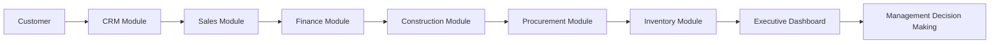
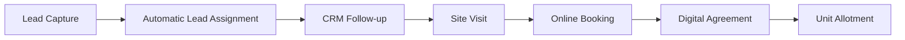
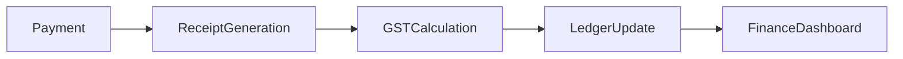
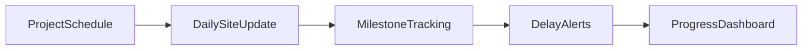
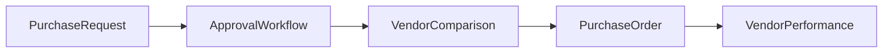
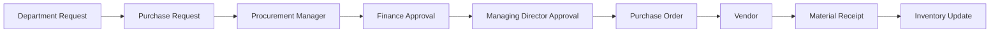
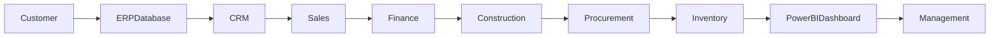
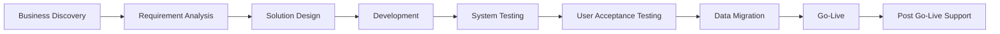

# TO-BE Process Analysis

> **Project:** Rajora ERP – Enterprise Residential Construction Management System  
> **Company:** Rajora Infra Homes  
> **Document ID:** TOBE-001  
> **Version:** 1.0  
> **Prepared By:** Shikha Phogat – Business Analyst  
> **Prepared For:** Rajora Infra Homes Management  
> **Date:** July 2026  
> **Document Status:** Final

---

# Document Overview

This document defines the future ("TO-BE") business processes for Rajora Infra Homes following the implementation of the Rajora ERP system.

It describes how existing manual processes will be transformed into standardized digital workflows through an integrated ERP platform. The proposed future state focuses on improving operational efficiency, increasing data accuracy, enhancing collaboration across departments, and enabling real-time business reporting.

The recommendations presented in this document are based on the findings documented in the **AS-IS Process Analysis** and provide the foundation for preparing the **Business Requirements Document (BRD)**, **Functional Requirements Document (FRD)**, **User Stories**, **Wireframes**, and **Solution Design**.

---

# Table of Contents

- [1. Purpose](#1-purpose)
- [2. Future Business Vision](#2-future-business-vision)
- [3. Proposed ERP Solution](#3-proposed-erp-solution)
- [4. Future Business Architecture](#4-future-business-architecture)
- [5. Department-wise TO-BE Processes](#5-department-wise-to-be-processes)
- [6. Future Approval Workflows](#6-future-approval-workflows)
- [7. Future Data Flow](#7-future-data-flow)
- [8. Future Dashboards & Reports](#8-future-dashboards--reports)
- [9. Future KPIs](#9-future-kpis)
- [10. User Roles & Responsibilities](#10-user-roles--responsibilities)
- [11. Business Benefits](#11-business-benefits)
- [12. AS-IS vs TO-BE Comparison](#12-as-is-vs-to-be-comparison)
- [13. Success Metrics](#13-success-metrics)
- [14. Risks & Assumptions](#14-risks--assumptions)
- [15. Implementation Roadmap](#15-implementation-roadmap)
- [16. Conclusion](#16-conclusion)
- [Document Approval](#document-approval)

---

# 1. Purpose

The purpose of this document is to define the future ("TO-BE") business processes for Rajora Infra Homes after implementing the Rajora ERP system.

The proposed future state introduces standardized business processes, workflow automation, centralized data management, and integrated reporting to improve operational efficiency across all business functions.

This document serves as the primary reference for designing the ERP solution and supports the preparation of the Business Requirements Document (BRD), Functional Requirements Document (FRD), User Stories, Wireframes, and Technical Design documentation.

---

## Objectives

- Standardize business processes across departments.
- Replace manual activities with automated workflows.
- Create a centralized business database.
- Improve collaboration between departments.
- Enable real-time reporting and KPI monitoring.
- Enhance customer experience and operational visibility.

> **Business Analyst Note**
>
> The TO-BE analysis focuses on designing practical business processes that address the operational challenges identified during the AS-IS assessment while supporting the company's future growth.

---

# 2. Future Business Vision

Rajora Infra Homes aims to implement a centralized ERP platform that connects all major business functions into a single integrated system.

The future operating model will eliminate fragmented spreadsheets and manual coordination by providing one reliable source of business information for all departments.

---

## Future State Vision

The proposed ERP solution will provide:

- Centralized business database
- Automated business workflows
- Digital approval processes
- Real-time dashboards
- Mobile-enabled site operations
- Standardized business processes
- Role-based user access
- Automated notifications and alerts
- Improved customer experience
- Faster management decision-making

---

## Expected Business Transformation

| Current State | Future State |
|---------------|--------------|
| Multiple Excel files | Centralized ERP database |
| Manual approvals | Digital approval workflows |
| Separate departmental records | Integrated business platform |
| Manual reporting | Real-time dashboards |
| Duplicate customer information | Single customer master |
| Delayed communication | Instant information sharing |

> **Key Observation**
>
> The future-state ERP solution will establish a single source of truth for business information, enabling departments to work with consistent, real-time data instead of maintaining separate records.

---

# 3. Proposed ERP Solution

The Rajora ERP system will integrate the company's key business functions into a single platform, allowing information to flow seamlessly between departments.

---

## ERP Modules

| Module | Purpose |
|---------|---------|
| CRM | Lead management, customer tracking and follow-ups |
| Sales | Bookings, unit allotment and agreement management |
| Finance | Customer collections, receipts, GST and outstanding balances |
| Construction | Project planning, milestone tracking and progress monitoring |
| Labour | Attendance, wage calculation and productivity tracking |
| Procurement | Purchase Requests, quotations and Purchase Orders |
| Inventory | Material receipts, issues and stock monitoring |
| Vendor Management | Vendor onboarding and performance evaluation |
| Dashboard & MIS | Executive reporting and KPI monitoring |
| Administration | User management, security and role-based access |

---

## Key Features of the Proposed ERP

| Feature | Business Benefit |
|----------|------------------|
| Centralized database | Single source of business information |
| Integrated modules | Better collaboration across departments |
| Workflow automation | Reduced manual effort |
| Digital approvals | Faster decision-making |
| Role-based access | Improved data security |
| Dashboard reporting | Real-time business visibility |
| Audit logs | Improved traceability and accountability |

---

# 4. Future Business Architecture

The future business architecture connects all departments through a centralized ERP database, ensuring that business information is entered once and shared across the organization.

---

## Future Information Flow

| Department | Primary Responsibility |
|------------|------------------------|
| CRM | Lead capture and customer management |
| Sales | Booking and sales activities |
| Finance | Payment management and financial reporting |
| Construction | Project execution and milestone tracking |
| Procurement | Material purchasing and vendor coordination |
| Inventory | Stock management and material movement |
| Management | Business monitoring and strategic decisions |

---

## Benefits of the Future Architecture

- One centralized business database.
- Elimination of duplicate records.
- Real-time information sharing across departments.
- Improved data consistency.
- Faster reporting and business analysis.
- Better coordination between business functions.

> **Business Analyst Observation**
>
> Unlike the current environment where departments maintain separate records, the proposed ERP architecture enables all users to work on a shared platform. This improves collaboration, reduces manual data entry, and provides management with timely and accurate information for decision-making.

---
---

# 5. Department-wise TO-BE Processes

The following section describes the future business processes after implementing the Rajora ERP system. The proposed workflows aim to standardize operations, reduce manual effort, improve data accuracy, and provide real-time visibility across all departments.

---

## 5.1 Sales Department

### Future Process

1. Leads captured automatically from multiple sources.
2. Automatic lead assignment based on predefined rules.
3. Customer interactions recorded within the CRM module.
4. Automated follow-up reminders.
5. Online booking management.
6. Digital agreement generation.
7. Real-time unit availability updates.

### Future Process Flow

### Expected Benefits

| Improvement | Business Benefit |
|------------|------------------|
| Automatic lead capture | Faster response to enquiries |
| CRM-based follow-ups | Better customer engagement |
| Digital booking | Reduced manual work |
| Centralized customer records | Elimination of duplicate data |
| Real-time unit availability | Improved sales coordination |

---

## 5.2 CRM Department

### Future Process

1. Maintain centralized customer profiles.
2. Record all customer interactions.
3. Send automated SMS and email reminders.
4. Track customer complaints.
5. Manage customer documents digitally.

### Expected Benefits

| Improvement | Business Benefit |
|------------|------------------|
| Centralized customer history | Complete customer visibility |
| Automated reminders | Improved payment and follow-up compliance |
| Digital document management | Faster document retrieval |
| Complaint tracking | Better customer service |

---

## 5.3 Finance Department

### Future Process

1. Record customer payments online.
2. Generate receipts automatically.
3. Calculate GST within the system.
4. Track outstanding payments.
5. Monitor financial dashboards.
6. Support bank reconciliation activities.

### Future Process Flow

### Expected Benefits

| Improvement | Business Benefit |
|------------|------------------|
| Automated receipts | Reduced manual effort |
| System-based GST calculation | Improved financial accuracy |
| Outstanding tracking | Faster collection follow-ups |
| Dashboard reporting | Better financial visibility |

---

## 5.4 Construction Department

### Future Process

1. Maintain project schedules digitally.
2. Update project milestones within the ERP.
3. Capture daily site progress.
4. Submit updates through mobile-enabled reporting.
5. Generate delay alerts.
6. Record quality inspections.
7. Monitor progress using dashboards.

### Future Process Flow

### Expected Benefits

| Improvement | Business Benefit |
|------------|------------------|
| Digital milestone tracking | Better project monitoring |
| Mobile reporting | Faster field updates |
| Delay alerts | Early issue identification |
| Executive dashboards | Improved project visibility |

---

## 5.5 Labour Management

### Future Process

1. Record digital attendance.
2. Allocate labour to projects daily.
3. Calculate wages automatically.
4. Monitor labour productivity.
5. Generate attendance dashboards.

### Expected Benefits

| Improvement | Business Benefit |
|------------|------------------|
| Digital attendance | Accurate attendance records |
| Automated wage calculation | Faster payroll processing |
| Productivity tracking | Improved workforce utilization |
| Attendance dashboard | Better labour monitoring |

---

## 5.6 Procurement Department

### Future Process

1. Create Purchase Requests online.
2. Route requests through automated approval workflows.
3. Compare vendor quotations digitally.
4. Generate Purchase Orders within the ERP.
5. Track vendor performance.

### Future Process Flow

### Expected Benefits

| Improvement | Business Benefit |
|------------|------------------|
| Digital Purchase Requests | Faster request processing |
| Automated approvals | Reduced approval time |
| Vendor comparison | Better purchasing decisions |
| Performance tracking | Improved vendor evaluation |

---

## 5.7 Inventory Department

### Future Process

1. Record material receipts digitally.
2. Update stock levels in real time.
3. Generate automatic low-stock alerts.
4. Track material issues to project sites.
5. Perform stock reconciliation.

> **Future Enhancement**
>
> Barcode-supported stock management can be introduced in later phases to further improve inventory accuracy.

### Expected Benefits

| Improvement | Business Benefit |
|------------|------------------|
| Real-time stock updates | Accurate inventory visibility |
| Automatic stock alerts | Reduced material shortages |
| Material tracking | Better inventory control |
| Stock reconciliation | Improved inventory accuracy |

---

# 6. Future Approval Workflows

The ERP system will replace paper-based approvals with a digital workflow that records approval history and provides visibility into request status.

### Purchase Approval Workflow

---

## Workflow Improvements

| Improvement | Business Benefit |
|------------|------------------|
| Digital approvals | Faster processing |
| Email notifications | Timely communication |
| Approval history | Complete audit trail |
| Pending approval alerts | Reduced approval delays |
| Workflow tracking | Improved transparency |

---

# 7. Future Data Flow

All departments will access the same centralized ERP database, eliminating duplicate entries and improving information sharing.

---

## Benefits of the Future Data Flow

- Single source of business information.
- Elimination of duplicate records.
- Real-time data availability.
- Better collaboration across departments.
- Faster management reporting.
- Improved business transparency.

---

# 8. Future Dashboards & Reports

The ERP system will generate dashboards tailored to different business users, enabling faster analysis and decision-making.

| Dashboard | Key Metrics |
|-----------|-------------|
| Executive Dashboard | Revenue, Collections, Construction Progress, Labour Productivity, Inventory Status, Procurement Status |
| Sales Dashboard | Leads, Bookings, Conversion Rate, Sales by Project, Sales by Executive |
| Finance Dashboard | Customer Collections, Outstanding Amount, GST Summary, Daily Collections, Monthly Revenue |
| Construction Dashboard | Project Progress, Milestone Completion, Delay Analysis, Engineer Performance |
| Labour Dashboard | Attendance Percentage, Labour Cost, Productivity, Daily Workforce |
| Inventory Dashboard | Current Stock, Low Stock Alerts, Material Consumption, Stock Valuation |
| Procurement Dashboard | Open Purchase Requests, Purchase Orders, Vendor Performance, Procurement Cycle Time |

> **Business Analyst Observation**
>
> Instead of manually consolidating reports from different departments, management will have access to role-based dashboards with up-to-date business information, improving operational visibility and supporting timely decision-making.

---

# 9. Future KPIs

The ERP system will automatically calculate business KPIs using centralized operational data.

| Department | Future KPIs |
|------------|-------------|
| Sales | Lead Conversion Rate, Booking Value, Sales Target Achievement |
| CRM | Follow-up Compliance, Complaint Resolution Time |
| Finance | Collection Efficiency, Outstanding Amount, Cash Flow |
| Construction | Project Completion %, Schedule Variance, Milestone Achievement |
| Labour | Attendance %, Productivity, Wage Cost |
| Procurement | Purchase Cycle Time, Vendor On-Time Delivery |
| Inventory | Stock Accuracy, Inventory Turnover, Material Consumption |

> **Key Observation**
>
> Automated KPI calculation will reduce manual reporting effort while providing management with consistent and timely performance metrics across all business functions.

---

# 10. User Roles & Responsibilities

The ERP system will assign role-based access to users, ensuring that employees can perform their responsibilities while maintaining data security and process accountability.

| Role | Key Responsibilities |
|------|----------------------|
| Managing Director | Executive approvals, business monitoring, strategic decision-making |
| CEO | Overall business performance monitoring and management review |
| Business Analyst | Requirements management, process improvement, stakeholder coordination |
| Sales Executive | Lead management, customer follow-ups, bookings |
| Finance Manager | Customer collections, receipts, reconciliation and financial reporting |
| Project Manager | Construction planning, project monitoring and milestone tracking |
| Site Engineer | Daily site progress updates, quality inspections and issue reporting |
| Procurement Manager | Purchase Requests, vendor coordination and procurement approvals |
| Store Manager | Inventory management, material receipts and stock issues |
| HR Executive | Labour attendance, employee records and payroll support |
| System Administrator | User management, security, system configuration and access control |

---

## Role-Based Access Principles

- Users will access only the modules relevant to their responsibilities.
- Approval authority will be assigned based on organizational roles.
- Sensitive financial and customer information will be restricted to authorized users.
- All significant business transactions will be recorded through system audit logs.

> **Business Analyst Observation**
>
> Clearly defined user roles improve accountability, strengthen data security, and ensure that business processes follow standardized approval workflows.

---

# 11. Business Benefits

The implementation of Rajora ERP is expected to improve operational efficiency, reporting capabilities, and collaboration across departments.

| Business Area | Expected Benefit |
|--------------|------------------|
| Sales | Higher lead conversion and improved customer experience |
| Finance | Faster collections and improved financial accuracy |
| Construction | Better project visibility and milestone tracking |
| Labour | Automated attendance and improved payroll accuracy |
| Procurement | Faster approvals and improved vendor management |
| Inventory | Accurate stock visibility and reduced material shortages |
| Management | Real-time dashboards and faster decision-making |

---

## Overall Business Benefits

- Centralized business information.
- Reduced manual data entry.
- Standardized business processes.
- Faster approval workflows.
- Improved collaboration between departments.
- Better reporting and KPI monitoring.
- Enhanced customer experience.
- Increased operational transparency.
- Improved management decision-making.

---

# 12. AS-IS vs TO-BE Comparison

The following comparison summarizes how the ERP solution transforms the current business environment.

| AS-IS (Current State) | TO-BE (Future State) |
|-----------------------|----------------------|
| Excel-based records | Centralized ERP database |
| Manual approvals | Digital workflow approvals |
| Paper-based labour attendance | Digital attendance system |
| Separate departmental files | Integrated business platform |
| Manual MIS reports | Automated dashboards |
| Delayed reporting | Real-time reporting |
| Duplicate customer data | Single customer master |
| Manual calculations | Automated calculations |
| Limited management visibility | Organization-wide operational visibility |
| Reactive decision-making | Data-driven decision-making |

---

## Business Transformation Summary

| Current Challenges | Future Improvements |
|--------------------|---------------------|
| Manual processes | Automated workflows |
| Scattered business data | Single source of truth |
| Slow communication | Real-time information sharing |
| Reporting delays | Instant dashboard reporting |
| Department silos | Integrated collaboration |

> **Key Observation**
>
> The proposed ERP solution addresses the major operational issues identified during the AS-IS analysis by integrating business functions, standardizing workflows, and providing real-time access to business information.

---

# 13. Success Metrics

The ERP implementation will be considered successful when the following measurable outcomes are achieved.

| Success Metric | Target Outcome |
|---------------|----------------|
| Duplicate data entries | 90% reduction |
| Manual reporting effort | 70% reduction |
| Purchase approval turnaround time | 50% reduction |
| Labour attendance capture | 100% digital recording |
| Construction progress visibility | Real-time monitoring |
| MIS reporting | Automated reports across departments |
| Customer follow-up compliance | Improved response and tracking |
| Management reporting | Dashboard-driven decision-making |

---

## Expected Business Outcomes

- Faster business operations.
- Improved data quality.
- Better reporting accuracy.
- Reduced manual effort.
- Increased operational transparency.
- Higher employee productivity.
- Better customer service.

---

# 14. Risks & Assumptions

Although the proposed solution is expected to improve business operations significantly, successful implementation depends on several organizational and technical factors.

## Project Risks

| Risk | Mitigation Strategy |
|------|---------------------|
| User resistance to new processes | Conduct user training and change management sessions |
| Data migration errors | Perform validation and reconciliation before migration |
| Delays in approvals | Define clear approval workflows and responsibilities |
| Incomplete requirements | Conduct requirement validation workshops with stakeholders |
| Technical issues during deployment | Perform pilot testing and phased implementation |

---

## Project Assumptions

- All departments will adopt the ERP system.
- Required IT infrastructure will be available.
- Historical business data will be migrated successfully.
- Business users will participate in training and User Acceptance Testing (UAT).
- Management will provide timely approvals throughout the project.

---

# 15. Implementation Roadmap

The ERP implementation will be executed in a phased manner to reduce business disruption and ensure successful adoption.

| Phase | Deliverable |
|--------|-------------|
| Phase 1 | Business Discovery & Requirement Gathering |
| Phase 2 | Business Requirements & Functional Design |
| Phase 3 | Solution Design & Wireframes |
| Phase 4 | ERP Development & Configuration |
| Phase 5 | System Testing |
| Phase 6 | User Acceptance Testing (UAT) |
| Phase 7 | Data Migration |
| Phase 8 | Go-Live |
| Phase 9 | Post Go-Live Support |

---

## High-Level Implementation Flow

---

# 16. Conclusion

The TO-BE Process Analysis defines the future operating model for Rajora Infra Homes following the implementation of the Rajora ERP system.

The proposed solution replaces fragmented manual processes with standardized digital workflows supported by a centralized ERP platform. This transformation will improve operational efficiency, strengthen collaboration between departments, enhance reporting capabilities, and provide management with real-time visibility into business performance.

Together with the **Business Discovery Document**, **Requirement Elicitation Document**, and **AS-IS Process Analysis**, this document establishes a clear roadmap for designing, developing, and implementing the Rajora ERP solution.

---

# Document Approval

| Role | Name | Status |
|------|------|--------|
| Business Analyst | Shikha Phogat | Approved |
| Project Sponsor | Managing Director Vishutosh Singh | Pending |

---

> **Document Status:** Final

**Version:** 1.0  
**Prepared By:** Shikha Phogat – Business Analyst  
**Project:** Rajora ERP – Enterprise Residential Construction Management System

---
