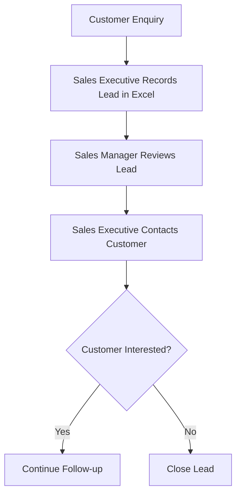
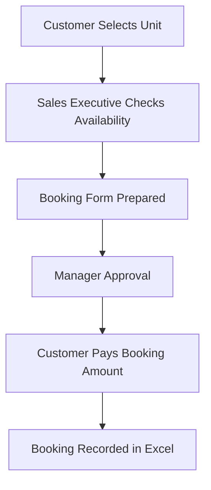
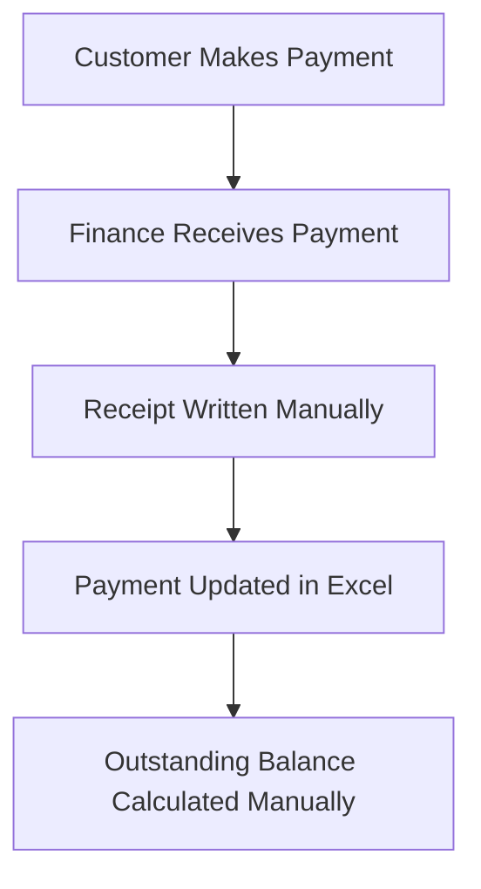
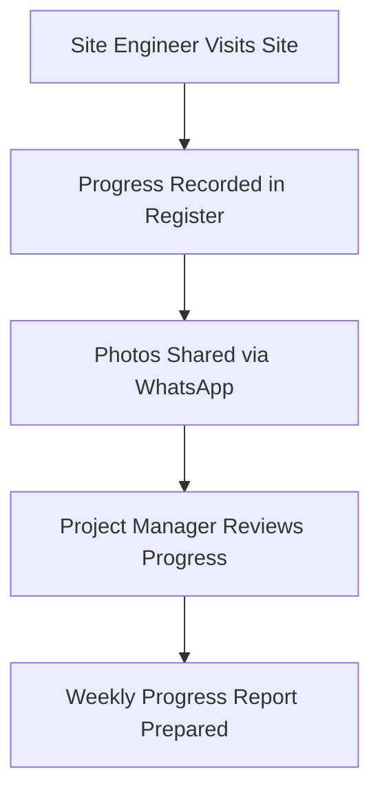
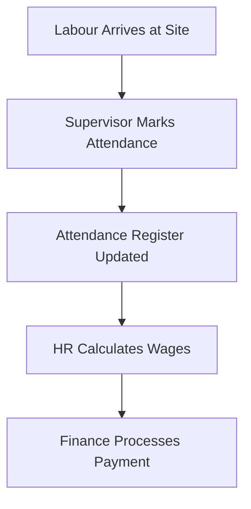
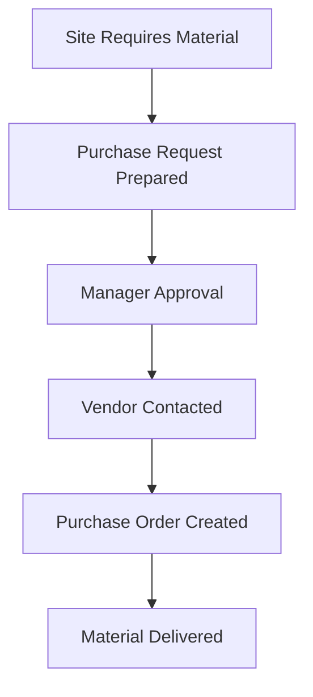
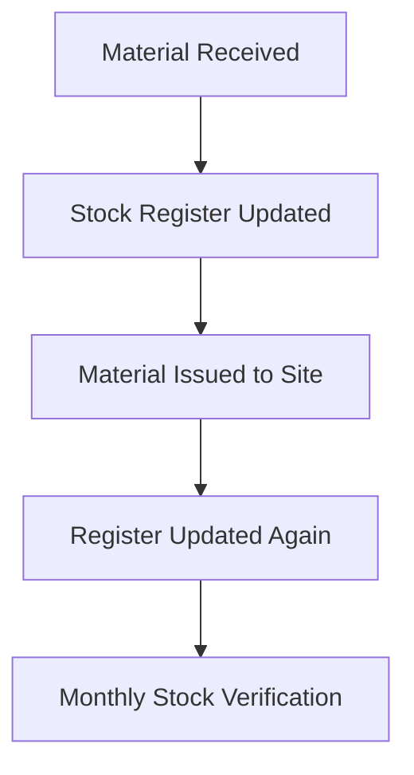

# AS-IS Process Flows

> **Project:** Rajora ERP – Enterprise Residential Construction Management System  
> **Company:** Rajora Infra Homes  
> **Document:** AS-IS Business Process Flows  
> **Version:** 1.0  
> **Prepared By:** Shikha Phogat – Business Analyst  
> **Status:** Final

---

# Document Overview

This document describes the existing ("AS-IS") business processes followed by Rajora Infra Homes before the implementation of the ERP system.

The purpose of documenting the current state is to understand existing workflows, identify operational challenges, and establish a baseline for designing improved future-state (TO-BE) processes.

---

# Table of Contents

- [1. Purpose](#1-purpose)
- [2. Existing Business Environment](#2-existing-business-environment)
- [3. Process Summary](#3-process-summary)
- [4. Lead Management Process](#4-lead-management-process)
- [5. Customer Booking Process](#5-customer-booking-process)
- [6. Customer Payment Process](#6-customer-payment-process)
- [7. Construction Progress Process](#7-construction-progress-process)
- [8. Labour Attendance Process](#8-labour-attendance-process)
- [9. Procurement Process](#9-procurement-process)
- [10. Inventory Management Process](#10-inventory-management-process)
- [11. Key Business Challenges](#11-key-business-challenges)
- [12. Summary](#12-summary)

---

# 1. Purpose

The objective of this document is to capture the current operational workflows before ERP implementation.

The AS-IS process analysis helps:

- Understand existing business operations.
- Identify manual activities.
- Discover process bottlenecks.
- Identify duplicate work.
- Highlight opportunities for automation.

---

# 2. Existing Business Environment

Before implementing the ERP system, Rajora Infra Homes managed most business activities using a combination of:

- Microsoft Excel spreadsheets
- Paper registers
- WhatsApp communication
- Email
- Manual approvals
- Physical document files

Each department maintained its own records, resulting in duplicate data, inconsistent reporting, and limited visibility across business functions.

---

# 3. Process Summary

| Business Process | Existing Method |
|------------------|-----------------|
| Lead Management | Excel sheets |
| Customer Booking | Manual forms & Excel |
| Customer Payments | Excel & physical receipts |
| Construction Progress | Daily registers & WhatsApp updates |
| Labour Attendance | Attendance registers |
| Procurement | Manual purchase requests |
| Inventory | Stock registers |
| MIS Reporting | Excel reports prepared manually |

---

# 4. Lead Management Process

## Current Workflow

### Current Challenges

- Leads maintained in separate Excel files.
- Duplicate customer entries.
- Follow-up reminders handled manually.
- No centralized customer history.
- Difficult to track conversion rates.

---

# 5. Customer Booking Process

## Current Workflow

### Current Challenges

- Unit availability verified manually.
- Risk of duplicate bookings.
- Paper-based approvals.
- Manual booking records.
- Delays in updating inventory status.

---

# 6. Customer Payment Process

## Current Workflow

### Current Challenges

- Manual receipt preparation.
- Payment history maintained in spreadsheets.
- Outstanding calculations prone to errors.
- Delayed financial reporting.

---

# 7. Construction Progress Process

## Current Workflow

### Current Challenges

- Progress updates are not centralized.
- Project information spread across multiple sources.
- Difficult to compare planned vs actual progress.
- Delayed reporting to management.

---

# 8. Labour Attendance Process

## Current Workflow

### Current Challenges

- Paper attendance registers.
- Manual wage calculations.
- Attendance errors.
- Time-consuming payroll preparation.

---

# 9. Procurement Process

## Current Workflow

### Current Challenges

- Manual approval process.
- Purchase requests tracked in Excel.
- Limited visibility of pending orders.
- Vendor information maintained separately.

---

# 10. Inventory Management Process

## Current Workflow

### Current Challenges

- Manual stock updates.
- No real-time inventory visibility.
- Difficulty identifying low-stock materials.
- High dependency on physical registers.

---

# 11. Key Business Challenges

The analysis identified several operational challenges across departments.

| Area | Challenge |
|------|-----------|
| CRM | Duplicate leads and inconsistent follow-ups |
| Sales | Manual booking management |
| Finance | Delayed payment tracking |
| Construction | Limited visibility into project progress |
| Labour | Manual attendance and wage calculations |
| Procurement | Paper-based approval process |
| Inventory | No real-time stock tracking |
| Reporting | Time-consuming manual MIS preparation |

---

# 12. Summary

The existing business processes at Rajora Infra Homes relied heavily on manual data entry, spreadsheets, paper-based records, and disconnected communication channels.

While these processes supported day-to-day operations, they resulted in duplicate work, delayed reporting, limited data visibility, and a higher risk of operational errors.

The findings documented in this AS-IS analysis provide the foundation for designing improved TO-BE business processes that leverage the Rajora ERP system to automate workflows, improve collaboration, and enhance operational efficiency.

---

**Document Status:** Final

**Version:** 1.0

**Prepared By:** Shikha Phogat – Business Analyst

**Project:** Rajora ERP – Enterprise Residential Construction Management System
